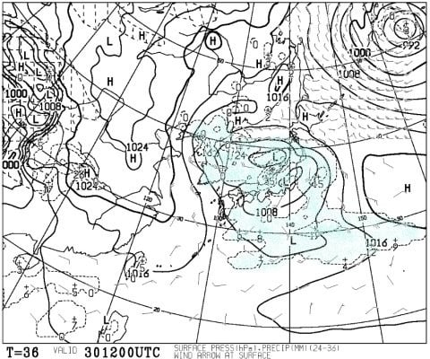

# 今週末も志賀高原！…土曜の気温は当初予想より上がりそう（涙）．でも，昼間は降らなさそうな予感！

📅 投稿日時: 2019-03-29 23:45:01

🏷️ カテゴリ: [日記](cc4b5682fb7b8b144980957a978653fb0.md)

なんということか．

本日も志賀高原は最高冷え冷えで．

[トップシーズン並みのコンディション
で楽しめた](https://red.ap.teacup.com/gokurakuskier/1074.html)ようですね…

あぁ…

今日，平日に滑れた人がうらやましい…

そして．

この土日ですが．

さっき，予想天気図を見てみると．

水曜段階の予想から，かなり

変わってるんですけど…！！！

まず，土曜朝9時の850hpa図は．

ふげえぇ！！！！

赤い0℃線が…志賀高原よりかなり北に

上がっちゃってるよ！！（涙）

ただ，午前9時の地上天気図は．

まだ低気圧が近づいておらず．

降水域が予想されてないので…

降らないはず．

この気温で降れば液体だけど．

少なくとも，昼過ぎくらいまでは

降らないはず…っ！！

そして．土曜夜9時の850hpa図は…

がーーーーん．

夜になっても，赤い0℃線は

志賀より北…（涙）

降れば液体の可能性が…（泣）

そして，地上天気図をみると…

ダメだ．

降水域が，志賀高原にかかって

るよ…（涙）

でも．

この様子だと…

降り始めは，ちょうどリフト営業終了

前後かな．

リフト営業中に，空から液体が降ってくる

可能性は少なそうです！！

そして．

リフト営業終了後も．

降ってもせいぜいパラパラ程度で

すみそう…

で．

翌日曜の850hpa図を見ると…

うむ．

この日は，赤い0℃線は志賀より南に

下がってます！

良かった！

そして，地上天気図は．

降水域が志賀高原にかかっているので．

おそらく，日曜朝はうっすら雪が積もって．

終日，曇時々雪がぱらつく…

って感じかな．

ってなことで．

まとめると

土曜：朝から気温は高め．

　通常営業開始時で，焼額山頂の気温は

　-1～-2℃程度か…

　曇り空でスタート．

　比較的柔らかめの圧雪．

　昼間は+3～5℃程度まで気温が上がり，

　ちょっとしっとり気味の重めの

　雪になっていくか…

　でも，日が射さないので，壊滅的に

　ザブザブな雪にはならない．

　夕方まで気温は高め．

　夕方，リフト営業終了前後に

　空から何かが落ち始める．

　日ごろの行いが良ければ雪．

　悪ければ液体．

　ただ，パラパラと落ちてくる程度で，

　びしょ濡れになるほどのことは無い．

日曜：前日夜の降り始めが雨でも，

　夜中に雪に変わり．朝までに数cm

　積もってそう．

　朝は曇り～雪がぱらつく天気．

　朝の気温は-4℃程度．早朝はもう少し

　冷えそう．

　早朝は，硬めの下地の上に新雪が数cm

　乗った状態で圧雪されるので，

　結構滑りいいのでは？

　この日は終日曇り～雪がぱらつく天気．

　午後，時折雪が強く降るタイミングも

　あるかも．

　気温は昼間でもマイナスをキープ．

　冷えているので，雪はそこそこ良さそう．

　ただ，前日の夜，空から落ちてくる液体の

　量が多めだったら…

　下地はかなり硬く凍った感じになり，

　斜度のあるバーンではツルツル下地が

　出てくるかも．

　前日，ほとんど液体が降らないようなら．

　この日は午後まで結構いい雪で滑れそう．

ってな感じでしょうか．

うーーむ．

土曜の昼間，降らない予想に変わったのは

いい感じだけど…

夕方～夜に，液体が落ちてこないことを

祈るばかり…

しかし．

月曜は終日冷え冷え雪になり．

火曜は冷え冷えの晴れになりそうな

予想は変わっていないので．

週末より，月・火が良さそうだなぁ…

あぁ…火曜はトップシーズン並みの，

とても4月と思えないコンディションに

なりそうなので．

火曜に滑りたいなぁ…

とりあえず．

火曜に滑るのは無理ですが．

この土日とも，また焼額で滑ってます～１

## 💬 コメント一覧

### 💬 コメント by (さち)
**タイトル**: Unknown
**投稿日**: 2019-03-30 10:07:19

昨日の最高冷え冷えを力尽きるまで堪能して、

本日は遅番のためゆっくりお部屋でコーヒー飲んでる者です。

週末あけたらまた冷えるらしいので楽しみです、えへへ。

### 💬 コメント by (Rikoriko)
**タイトル**: Unknown
**投稿日**: 2019-03-30 15:45:51

今日は休憩日と決めていたのですが、結局朝から薄曇りだったので８時過ぎのリフト運転開始から１３時まで滑りました〜。

１１時頃からは雪が腐り始め、平地では前転しそうなぐらいスキーが滑らなくなったので、その後はコブ三昧！！

熊の湯は複数の団体さんが入っていて満員御礼状態でした。

予想では月曜火曜が良さそうとの事なので、明日休息日にして来週の平日また頑張りまーす。

毎回うらやましがらせて申し訳ありません。

思いきって早期退職＆スキー三昧生活はいかがですか？（笑）

### 💬 コメント by (Skier_S)
**タイトル**: 今日はちょいと残念な感じ
**投稿日**: 2019-03-31 00:56:19

＞さちさま

今晩はお疲れさまでした~．

来週は冷えますよ…

また来週どんなだったか，レポートお待ちしています~！

＞Rikorikoさま

いや…

志賀高原常連の，リタイヤ後に志賀高原で長期住み込んでいる

方々の話を聞くと．

私も早く志賀高原に移住したいなぁ…

と思う今日この頃ですが．

…少なくとも，娘が独り立ちするまでは会社で働かないと（笑）．

来週平日，いいコンディションだと思いますよ～！！

