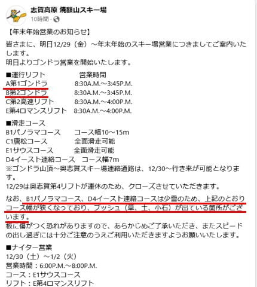

# 明日からの正月休みすべて志賀高原で過ごします

📅 投稿日時: 2023-12-29 01:05:36

🏷️ カテゴリ: [日記](cc4b5682fb7b8b144980957a978653fb0.md)

ということで．

なぜか本日も，いろいろやっていたらこんな時間…

もう夜1時過ぎだよ…

でも．

明日から5泊6日で志賀高原で滑り倒します！！

…昨シーズンは正月休みにスキーができず，

今シーズンは実に久しぶりの，6日間連続

スキーをいれたというのに，

こんな年に限って雪不足とは…

何の嫌がらせだ（涙）

で．

予告通り，明日から焼額山は第1，第2ゴンドラの

2本のゴンドラが動きます～！！

（[焼額山スキー場ホームページ](https://www.princehotels.co.jp/ski/shiga/winter/)より）

…とはいえ．

滑れるのは2ゴン側のパノラマコース．

1ゴンに乗った場合，2ゴン側をぐるっと

回って，最後の緩斜面を漕ぎながら

1ゴンへ回ってくるパターンです…（涙）

そして，

案内文に書いてあるように，コース幅が

狭くてブッシュが出ているようです…

こんなコースに，ゴンドラ2本分の

お客さんを送り込んで大丈夫か！？？？

これから31日の夜までは雪がほとんど

積もらないので，29日でかなり雪が

はがれて，30日はひどいことになりそう…

さらに31日は雨になるので．

コースがもつかどうか心配…

31日の雨は，午後に結構強くなりそう

な予報だけど…

夕方に雪になるので．

雨が強くなる前に雪に変わって，

雪が強く降ることに期待…っ！！

そして，1日の朝までに，1mほど

積もってほしい…（懇願）

そうじゃないと，この正月休み，

ちょっと悲惨すぎる…（泣）

ってなことで．

明日から5泊6日で志賀高原を

滑ってます～！！

…でも．

あと2時間半後に出発だよ…

また2時間しか寝られない（泣）

## 💬 コメント一覧

### 💬 コメント by (アツシ)
**タイトル**: Unknown
**投稿日**: 2023-12-29 03:02:06

私は正月休み今日から５日間滑ります。白馬、上越、湯沢と移動して、1/2に志賀で滑って、そのまま大阪に帰る予定です。半年前から宿取って楽しみにしてました。ワクワクしますね❗️

### 💬 コメント by (1kamakura)
**タイトル**: Unknown
**投稿日**: 2023-12-29 06:05:02

江戸の秋

あー羨ましい！

Sさんは親族で集まる必要が無いのですね。

五泊できるなんて凄い！

いつも働き詰めですから、しっかりとリフレッシュしてきてくださいね。

雪が降るようにお祈りします！

降れ降れ雪よ

降り積もれ〜‼️

### 💬 コメント by (たぉ)
**タイトル**: Unknown
**投稿日**: 2023-12-29 11:59:46

私も明日から2泊予定ですが明後日雨って（泣）今年厳しいですね。アトミックの4Sで滑ってますー

### 💬 コメント by (真美子)
**タイトル**: Unknown
**投稿日**: 2023-12-29 14:21:37

赤黒のウエアで、38年前のピンクのBOYAのリュックを背負って一生懸命滑りました。

が、そろそろ限界。

転べないので、引き上げるしかない。

会いたかった‼️です。

30日は午前中のみ滑るので、明日こそお会いできたら、幸せだわ。

### 💬 コメント by (Skier_S)
**タイトル**: ダメだ…この正月休みはダメだ…
**投稿日**: 2023-12-29 22:28:27

＞アツシさま

今日の志賀はダメな感じでした（涙）

でも，1月2日なら状況は改善していそう．

いいタイミングでの志賀参戦かも…

＞江戸の秋さま

実は…志賀高原で親類3家族が集まります．

帰省の代わりに，志賀高原で集まってるんですよ…

＞たぉさま

明日から参戦ですか…

焼額より，一ノ瀬・奥志賀方面が良いかもしれません．

でも，どっちにしろ混むと思います．

残念ながら，31日はかなり残念なコンディションだと思います…

そうならないよう，冷え冷え踊りを全力で踊りましょう…

＞真美子さま

BOYAのリュック，目印に探します．

私は…普段はあまり自分のウェアの情報をさらさないのですが，

今回は特別に．上下そろいのオレンジのウェアに黒いFISCHER板を目印に探してください．

