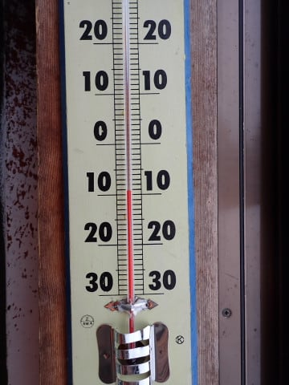
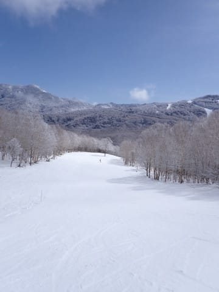
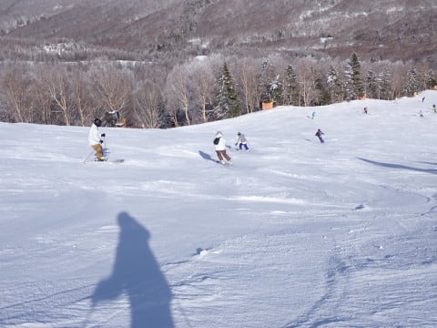
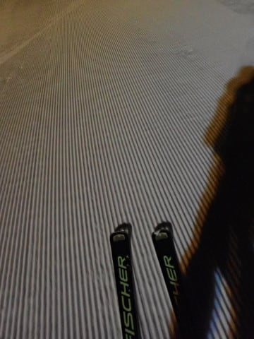

# 2024/2/24(土)の志賀高原焼額山スキー場は…予想と違いガリガリバーンじゃなく良かったよ！午後は一部ツルツルだったけど晴天でいい感じ！

📅 投稿日時: 2024-02-25 00:15:15

🏷️ カテゴリ: [2024スキー滑走日記](c453f687e8a0f05679e95831d0a02cd0c.md)

ってなことで．

本日から志賀高原へ復活しました～！！

昨日は最悪激烈ガリガリバーンだったし．

今日もガリガリバーンだと思っていたのに…

今日は意外なことにガリガリバーン

じゃなく，午後は天気も良く，予想以上に

楽しめました～！！！

今日も朝，志賀高原の上り坂を登って

行きますが…

朝はうっすら雪が積もったのかな？

スキー場に近づくと，道路はうっすら

積雪路でした…

いつも通り，朝8:30の焼額第１ゴンドラの

通常営業開始前に並びますが…

さすが３連休の中日．

普通の土日より列が長めで．

今日は混みそうな予感…

ってなことで．

営業開始のゴンドラに乗って，

山頂に向かいますが…

あさイチの天気は予想通り曇り空．

そして，山頂の気温は-９℃でかなり

冷え込んでいたので…

これは今日も冷え冷えガリガリだな，

と思っていたら…

どうやら，昨日から２－３㎝程度ながら，

うっすら積雪があったのがいい方向に

効いたのか…

いや，これ，固めながらも結構エッジが

食い込む気持ちいいバーンじゃないですか…！！

これ，危惧していた

志賀高原　春の全面アイスバーン祭り

じゃないですよ…！！

トップシーズンの柔らか雪ではないけど，

スピードが乗ってエッジが食い込む，

気持ちいいハイスピードバーン

ですよ！？←それは，予想を外したということですね

そして，さらに．

朝９時過ぎにはうっすら日も射し始めて…

いや．

これ，全然がちがちバーンじゃない．

むしろ気持ちよくて楽しいバーンじゃ

ないですか…！！←それは，予想を外したということですね

神様はやっぱり私の日ごろの行いの

良さを見て，私が来ない昨日はひどい

雪だったところ．

私が来る今日は，日ごろの行いの良かった

私のために，すごいいい雪質にして

くれたに違いない…！！←違うから

ふははははは！！

皆さん，私に感謝！！←全力で違うから

…ただ．

やはり３連休の中日というだけはあって…

朝９時半には，ゲレンデの人口密度も

上がり．

一ノ瀬から人が流れてくる第２高速も

かなりの列になったようで…

そして，10時には，第1ゴンドラもすごい列

に…（涙）

でも，第1ゴンドラはフルで8人乗車になるよう

整理していたので，列の流れが速く，

これでも5分待ちくらいでした．

第3高速もゲートの外まで並び，

10時から11時ごろまでは5分待ち（涙）

でも，第1ゴンドラが5分待ったのは

10時から11時までの1時間だけ．

11時を過ぎると，あとは大体ゲート内の

待ちで納まり…

昼から午後の少ないときはこのくらいの

待ち時間で済んだので．

3連休中日としては，ゴンドラ待ちは

拍子抜けするくらいの少なさでした～！

そしてさらに．

晴れるのは午後からと思っていたところ．

午前11時には青空が広がり…

昼前に，完全に晴れになっちゃったんですが？？

曇り空のガリガリバーンを覚悟したのに，

晴れてエッジがしっかり食い込む気持ちいい

雪を滑れるし．

3連休中日なのに．

コースを選べばそんなに混んでないし…

これ，今日，意外と楽しいんです

けど！？？←だから，それは予想を激しく外してるよね…

…ただ．

ごく一部のコースで，この1週間の高温＆雨の

影響で，土が出始めてきていて…

ブナコースの一部は，ちょっと残念な感じで

土が出始めてます…（涙）

そして，白樺コースも…

コースの真ん中が茶色くなり始めていて…

土が出ているところは事前に見えるので，

回避可能なものの…

うーーん．

2月の志賀高原で，コースに土が出てきたことが

これまでにあっただろうか！？？？

雪が…雪が少ない…

さらに．

この雪の少なさのせいで．

本日は非圧雪ながらなんとかオープン

していたオリンピックコースも．

午後2時前に，コース状況悪化のため

あえなくクローズ（涙）

これまで歴史上，2月にオリンピックコースが

雪不足でクローズしたことがあっただろうか？？

（いや，ない…反語）

とはいえ．

それ以外の，唐松コースやGSコース，

パノラマ，サウスコース，イーストコースと

いった主要コースは，土が出てくる

気配もなく．

昼過ぎは，すっきり晴天で，そこそこ冷えた

いい雪で．

予想の100倍いいコンディションで

気持ちよく滑れました～！！

ただ．

午後はリフト待ちがほとんどなかったにも

かかわらず，今日は午後2時を過ぎても，

人が多いGSコースとサウスコースの

二つのコースは，人口密度が下がらず…

この2コースは，午後2時を過ぎると，

ちょっとボコボコになり始め…

そして，ボコボコの谷間は下地の

ツルツルが出始めてきました…（泣）

エッジを立ててない人は，ここでかなり

ツルッと行きますね…

一方，第2高速リフト沿いの唐松コース．

ここは日が射す南向きということもあり．

ほかのコースはツルツルだったところ．

このコースは雪が緩んで…

ボコボコにはなってきたものの．

雪が緩かったので，ツルツル下地は

出てきませんでした～！

…でも，雪は重めでしたけど…

ってなことで．

ラストのGSコースは，かなりツルツル＆

凸凹になっちゃったものの．

危惧していた，朝からツルツルガリガリバーン

という昨日の状況とはうって変わって，

昼過ぎまでは結構楽しめるバーン状況で．

眼下に見事な雲海を見ながら．

今日も営業終了の16時15分まで，

昨日滑れなかった憂さを晴らすべく，

休みも取らずひたすら第1ゴンドラを

ぐるぐる滑り続けたのでした…

いやーーー．

昨日は，阿鼻叫喚のゲレンデ状況レポートが

送られてきていたので．

今日は全く期待していなかったのですが…

いや．よかった．

今日は意外と楽しめた…

やはり日ごろの行いはよくしておくべき

ですね！！←違うから．あなたのおかげでコンディション良くなったわけじゃないから

…ってなことで．

本日も1日楽しんだけど．

まだナイターがある！！

でも．18時からの本日のナイター，

焼額ナイターの今シーズンの最終営業日です…（涙）

泣いても笑っても，今日が今シーズンラストの

焼額ナイター．

当然，行かないという選択肢はないですね…！！

ってなことで．

ほかのスキー場とは一線を画す，

焼額クオリティのぴかぴか圧雪かけたての

バーン，いただきま～す！！

ちょいと硬めの圧雪ながら．

夕方の硬い下地はシマシマの隠されて．

スピードが乗るバーン！！

もうひたすらトップスピードで落下！！

うーん．

今日でナイター終わりとはさみしすぎる…

…と，名残を惜しみながら．

ナイターも今シーズンの営業終了となる

20時まで，しっかり滑り倒したのでした…

いやー．

予想外に楽しめた本日でしたが．

多分，明日も雪はそこまでがちがちに

ならずに済みそう．

明日も一日楽しんできます～！

## 💬 コメント一覧

### 💬 コメント by (Ski46)
**タイトル**: Unknown
**投稿日**: 2024-02-25 06:47:58

徒然さん

昨年の春の投稿以来ですが、毎日欠かさずチェックさせていただいておりました。

2/24(土)は、晴天の時間も多く、

バーンコンディションも一部を除き、そこまでアイスバーンでもなく…

良い方に外しましたね(笑)

朝のゴンドラ待ち、意外と後ろにいらしたのでビックリ

我が家の4人(グリーン系、ピンク系の子供たちを含む)もゴンドラ待ち写真に登場中(笑)

途中16:30頃、東館の前(我が家は雪遊び中)

ナイター(部屋から見学)にお見かけしましたが、

さすがフロントローをキープされていましたね。

今日は、ファーストトラックのみ参加するか考えております。

また志賀高原(焼額山)の詳細レポートお願いします！

### 💬 コメント by (Skier_S)
**タイトル**: ＞Ski46さま
**投稿日**: 2024-02-26 00:54:42

24日は，ホントにいい方向に予想が外れてくれました！！

あさイチはぎりぎりの到着だったので，列のかなり後ろの方でした…

ナイターで並んでるのも見られてたのですね（笑）

今日はファーストラック参加されたんでしょうか．

午前中にゴンドラが終わっちゃったし，ふぶいて大変だったし早いうちからアイスバーンになったので，

ファーストトラックが正解だったかも…

### 💬 コメント by (Ski46)
**タイトル**: Unknown
**投稿日**: 2024-02-27 00:34:56

徒然様

ナイターでは、

子供たちが、『徒然さん、帰っちゃっよ』って言うので、外を見ると一直線に東館方面に向かう徒然さんが横切りました。

妻は『トイレじゃない？』って言っていましたが、

『徒然さんに限って、開始30分でトイレはないでしょう』と憶測のぶつかり合い(笑)

(日)は、ファーストトラックのみ、小2の息子と2人で参加しました。

ファーストトラックは、意外にもガリガリではなく、いい感じのバーンでしたね。

ほぼ毎週、様々なスキー場に出ていますが、2本滑って終了という日もある中、

昔、子供たちを背中に背負って滑っていた頃、

『青と緑のライオン』っ息子が言っていたのを思い出します(笑)

(日)の話に戻ると

徒然さんを追尾しようかと、ファーストトラックギリギリのタイミングで3本目を上がり、

20000mチームが向かって、徒然さんも向かうかと思ってパノラマ方面に向かう手前で待機していたところ、まさかと直進！？

小学校2年生の息子とパノラマアウトを滑って終了しました。

帰りの高速、大変だったかと思います。

また、春にお会いできればと思います。

今年は、雪がもつかどうか…

### 💬 コメント by (Skier_S)
**タイトル**: ＞Ski46さま
**投稿日**: 2024-02-27 03:03:40

ナイターでは，トイレ休憩を取りに行ってました（笑）．

ちゃんとナイターラストまで滑りましたよ~！

日曜はあさイチGSコースに行ったので，パノラマ方面ではなかったです…残念．

また春にお会いしましょう！

