# あけましておめでとうございます！…元日の志賀高原スキー場は，パフパフ超パウダーデー！！

📅 投稿日時: 2015-01-01 20:42:34

🏷️ カテゴリ: [2015スキー滑走日記](c09ea645cfc085f86dfcd80f49599dd89.md)

えー．

あけましておめでとうございます．

なにやら，年が明けたらしいのですが…

相変わらず志賀高原にいる，Skier_Sです．

さて．

元日の志賀高原，焼額の状況ですが…

本日は，ニューイヤーファーストトラックが開催されて．

朝7時前という暗いうちからゴンドラに乗り…

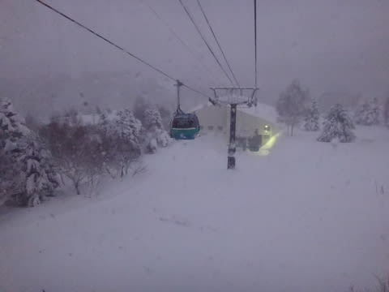

山頂に向かいますが…

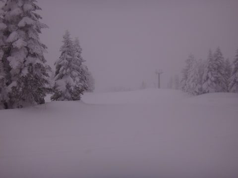

ふむ．

すごい雪だよ．

…とてもじゃないけど，初日の出を拝める状況ではないですな…

んで．

朝イチの山頂は，マイナス14度と．

寒いよ！

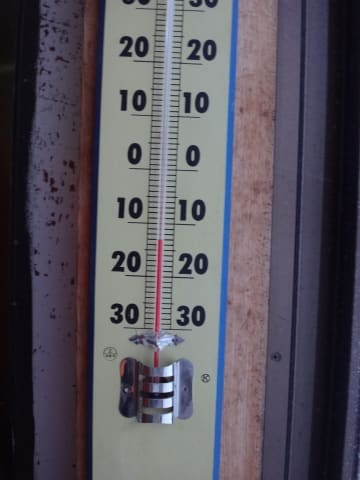

そして，ファーストトラックのスタートラインに立ち…

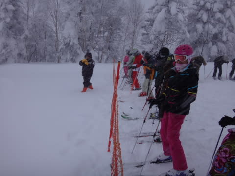

いざ，スタートっ！！

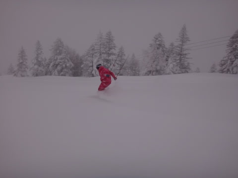

圧雪コースも，ブーツが埋もれるくらいの新雪だよ！

で，

オリンピックコースの非圧雪エリアに出ると…

うはーーーっ！！

これは…腰パフだよっ！！

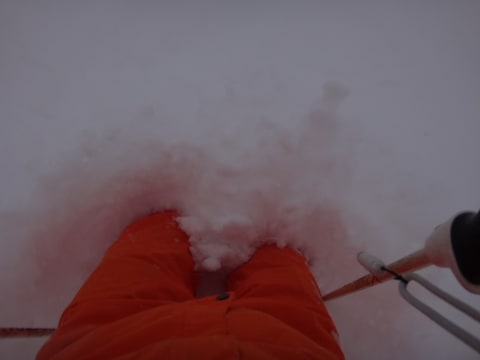

ところどころ胸より深い新雪で．

顔に雪が舞い上がる！！

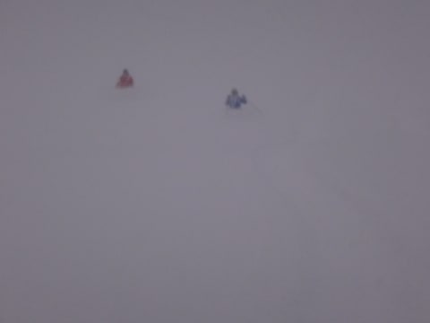

これは，すごい！

50cm超の，めったにないレベルの雪の量！

[以前から予告していた](ebe20f0f0a9c9369de8409706896c3475.md)とは言え．

胸までの雪をラッセルして滑るなんて，

シーズン1度あるかないかのパフパフ！

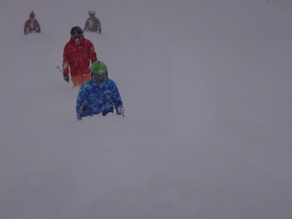

当然，こんな天気なので，圧雪コースも

終日雪が降り続け，終日ブーツパフ状態で…！

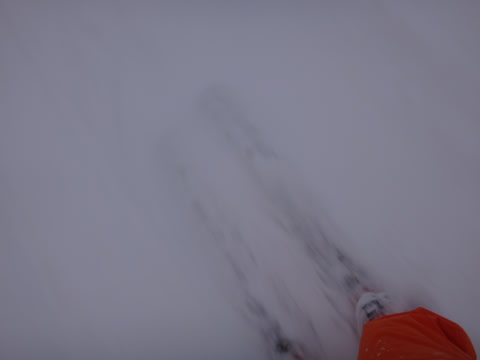

朝のうちは，プチパウダーで楽しめたけど…

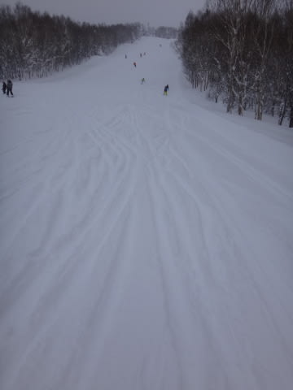

時間が経ってくると，荒れ荒れでこぼこ斜面になってきて．

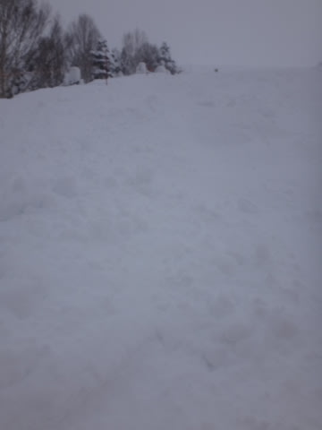

日が差さないので，でこぼこが見にくく，ちょいと

みにくいゲレンデコンディション…（涙）

ちょっと滑りにくかったよ…（悲）．

せめてもの救いは．

元日，かつ悪天候というのもあり．

ゲレンデの人口密度は，昨日までに比べると

低かったかな～．

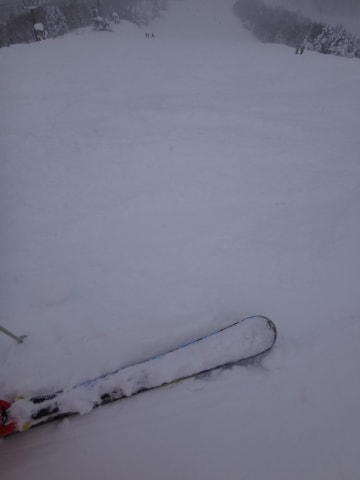

ゴンドラ待ちも，終日ほぼなくて．

人も少なめだったのが救いだったかな…

でも．

終日，雪が降り続け．

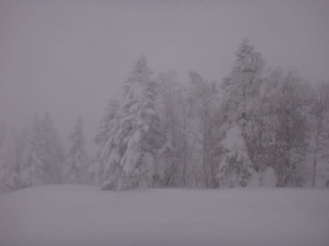

時折うっすらと日が差すものの…

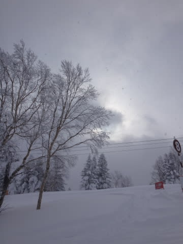

午後まで，コース全面モフモフ状態が続き．

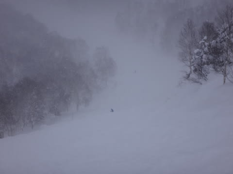

夕方4時ごろになっても，コース全面に新雪が

供給され続け．

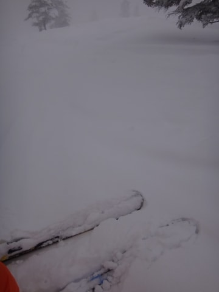

うむ．

さすがの私も．

午後はかなり体力が尽きかけた一日でした…

で．

夕方になっても，すごい雪が降り続き．

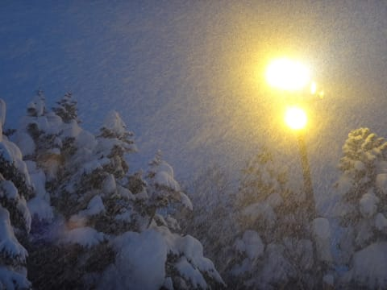

ナイター照明がつくころには．

滑る人もほとんどなく．

あっという間に，ゲレンデがブーツパフ状態に

なっちゃう，すごい雪の降り方でした…

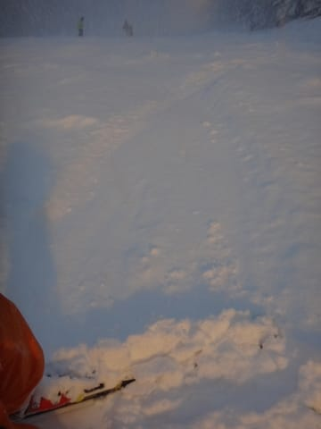

だもんで．

…明日の朝も，たぶん．

新雪パフパフだろうなっ！！

新雪狙いの方，明日も朝イチねらい目ですよ！

＃終日雪が降り続け，圧雪狙いの方にとっては，

＃残念な一日になりそうですが…
