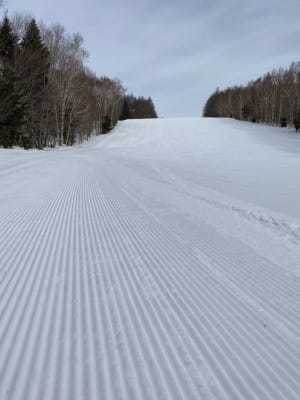
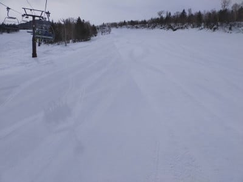

# 2021/3/8(月)の志賀高原スキー場特派員レポート…そしてこれから一週間の天気は？気温は高め，雪は積もらず13日(土)は雨？？

📅 投稿日時: 2021-03-09 05:59:09

今日もちょっとバタバタしているので，朝更新…

ということで．

本日も優秀な特派員が何人か

志賀高原へ送り込まれているわけですが…

今日は雲が多めの朝だったようで．

気温はそれほど低くなく．

昨晩からの積雪も0だったようなので．

今日のおこみんは，シマシマの上ですね…

で．

あさイチから山頂の気温は-2℃と

ちょい高めの気温．

朝のうち，一の瀬の山頂付近は

ガスがうっすらかかっていたようですが…

焼額は日が射してますね！

そして…

見事なシマシマ！

でも，あさイチはガチガチかな…？

と思ったら，夜の冷え込みがそれほどでも

無かったのか．

しっかりエッジが食い込む，緩み気味の

シマシマでスタートだったようです！

唐松こーすかな？

これも気持ちよさそう！

ただ，GSコースは朝のうち一部ちょっと

コロコロが出たようですが…

日が射して，気温が上がったので，

すぐに雪は緩んでコロコロは消えて

行ったようで…

午後1時ごろには，気温も+4℃くらいまで上がって

しまい…

焼額は昼ごろには，完全にずっしり重い

春の雪になっていったようです…（涙）

でも，昼前に晴天になったにも関わらず．

朝は日陰になる西斜面の一の瀬や…

高天ヶ原方面は比較的締まったいい雪で．

日曜と同じく，寺小屋が最高だったようです…！

ちなみに奥志賀はエキスパートコースが

今日も圧雪車故障で非圧雪となり．

さらに，奥ゴン，焼額ゴンドラとも，

今日はちょっと混んでいた…という

報告を受けています．

で．

ゴンドラに待ちがあるほどの人が

来ていた焼額．

雪が緩んだこともあり，午後になると

ちょっとゲレンデが荒れて…

夕方は，斜度のあるところちょっと

ボコボコになっていたようです…

…ってなことで．

今日も優秀な数名の特派員がラストリフトまで

残ったようで，

最後の午後は，雲海がきれいだったようですね…！

特派員の皆様，ありがとうございました～！

そしてこれから一週間の天気ですが．

天気図を見ると，これから一週間，ひたすら

気温は高めですね（涙）

雪が降る気温ではなく…この1週間，新しい雪は

ほとんど積もらなさそう．

それどころか…13日(土)は雨の危険性が…

うーん．

また追って詳細天気レポートやります！

PS.コメント回答もしばしお待ちください

## 💬 コメント一覧

### 💬 コメント by (レインボー73)
**タイトル**: Unknown
**投稿日**: 2021-03-09 11:37:59

火曜日の志賀高原情報

朝の上林ー２℃、2ゴン山頂ー２℃。パノラマ、カラマツは硬い。昨日の妙高と大違い。エキスパは今日も未圧雪、奥ゴンは風もないのに注意運転との情報で、今日も奥志賀は管轄外にすることに。

さすれば目指すはチウホテルか横手の富士山か？

ＧＳも硬めでめっちゃ快適。

シラカバはセンターラインに大きな穴が。危険が危ないです。

9時30分にはブナは早くもゆるゆるに。カチンカチンのダイヤモンドから逃げてきた友人は、二高に来て一息ついたそうな。

10時前のダイヤはもう硬くない。

寺子屋が手頃な快適バーンで11時まで夢中で回してました。ファミリーもフラットな快適バーン。

久々にチウホテルに行くも、またまた休業。なかなかシチューにありつけません。そんな訳で今日もまた銀嶺でざるそばです。

### 💬 コメント by (つーちゃん)
**タイトル**: Unknown
**投稿日**: 2021-03-09 17:43:53

えーーヤッパリ雨ですか…

なんだか１ヶ月早く季節が巡ってきてしまった感じです(ToT)

この後もあまり冷える気配も無いですし…

こうなってくるとラスリフまで生き残れるのは

五バk……おっと。五天王だけです

### 💬 コメント by (レインボー73)
**タイトル**: Unknown
**投稿日**: 2021-03-09 18:38:08

火曜日の志賀高原情報２

柔らかい西館を林道から降りたら、怪我人が運ばれてる。今日は怪我人続出の日でした。

ジャイアントは勘違い食い込みバーンだったけど、流石にあの遅いリフトに２回乗る暇はない。人生、先がないんだから。

午後の寺子屋も良かったですよー。帰りのパーフェクタはポールの片付け中でパノラマへ。

ダイヤはゆるいながらもまずまず。

カラマツ、サウスはズクズクだけど、板つかみが昼寝してたので何とか楽しめるレベルでした。

やっぱり志賀高原さいこう！

### 💬 コメント by (Seeker.NT)
**タイトル**: 奥志賀
**投稿日**: 2021-03-10 09:35:59

奥志賀はウィンチ付き圧雪車の故障でエキスパが未圧雪となって約１週間。(今シーズン３度目かな)

カリカリに固まったコブは、１０数年以上前の人を寄せ付けないほどの難コースだった頃をなつかしく思い出しました。(当時はもっと深く大きくえぐれているコブでしたが。。。)

ウィンチ付き２台あったと思ったんですが、いつのまにか１台になっちゃったんでしょうか。

あぁ、昨今のスキー人口減少時に、奥志賀高原リゾートさん、こんな状況で良いのでしょうか・・・と思わざるを得ないんですが、ぜひ頑張って欲しいところです。

### 💬 コメント by (Northfox)
**タイトル**: ラニーニャは．．．？
**投稿日**: 2021-03-10 13:20:24

今シーズンは天候の高温化予報に悩まされる週末が多いです。1月から雨におびえてましたからね。。。。

来週末の20-21日は寒気団が出てくるとかの話しも小耳にしたので、それに期待したいです。

### 💬 コメント by (Skier_S)
**タイトル**: コメント回答遅れました…
**投稿日**: 2021-03-11 03:03:08

＞レインボー73さま

天気が良かったようでうらやましいです…

週末は天気が悪そうなので，金曜までに思う存分滑り倒しておくことを

おススメしておきます…

＞つーちゃんさま

雨です．

残念ながらどうしようもなく雨です．

悔しいことに雨です…

＞Seeker.NTさま

エキスパの圧雪車，今シーズン2度目の故障ですね…

圧雪車の修理，かなりお金がかかるようなので痛いでしょうね…

でも，最近は雪が硬くなる春先に毎年壊れてる気がします．

＞Northfoxさま

今シーズンは意外と2月途中からダメな感じですね…

また奇跡の4月になるよう祈るしかなさそうです．

