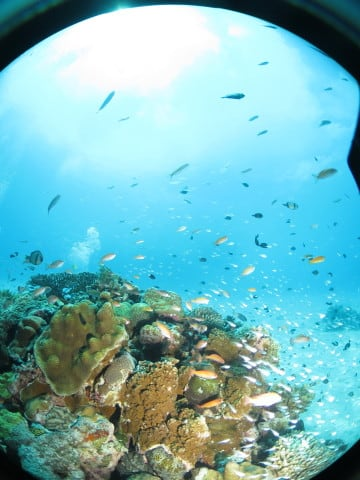
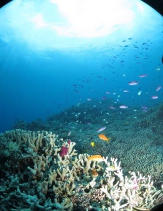
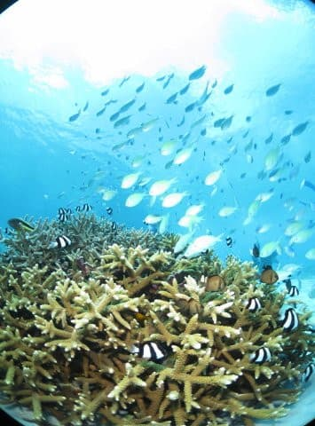

# 2023年8月，座間味で親子3世代ダイビング！その18…今回の旅行のラストダイビング！

📅 投稿日時: 2023-10-08 02:00:12

この週末，3連休だったんだ…

と気づいたのが，つい先日．

3連休なら，休日に仕事をたっぷりできる

から，平日の夜に寝ちゃっても大丈夫だ！

これはうれしい…！！

…と，ちょっと心に余裕ができた

先週後半だったんですが．

休日に仕事をすることが前提になっている

ことが，すでにおかしい

ということに気づいてなかった，Skier_Sです．

ってなわけなので．

仕事をすることが前提になっている

この3連休．

予定通り，仕事しています…（泣）

だもんで．

どこにもいかない3連休．

ネタもないので，[先日の続き](ea96c4e7827cdd16184016fe0772a3860.md)の

ダイビング日記です…

ーーー

ということで．

お昼休みの後，本日の3本目のポイントへ

移動しますが…

やってきたのは，ガヒ島ビーチのすぐ向かい，

座間味島の阿真ビーチ前ですね…

ここも海がきれい！！

ダイビングラストデーの本日．

今日最後のこの3本目が，今回の

旅行の最後の1本になりますね…（涙）

3日間で計9本潜りましたが，

まだ全然潜り足りない感じ（泣）

あぁ…どうして楽しい時間はこんなに

短いのか…！！！

とりあえず．3本目のブリーフィングを

受けますが．

ポイント名は「阿真のエダサンゴ」．

昨日の3本目と同じ阿真ビーチ前ですが，

狙うポイントは別の場所のようです…

器材を背負って準備したら…

ラストダイブへ，Go！！

ビーチ前なので，エントリーした船の下は

砂地ですね…

いきなり目の前に，巨大ヤドカリがいました．

白砂の中に，ポコポコと小さな根が

ありますが…

どれも写真映えする，スズメダイ・ハナダイや

スカシテンジクダイがいっぱいついた，

華やかな感じの根です…！！

いやー．

ダイビングをやらない人も，

沖縄の海って言ったらこんなのを

イメージするんじゃないかな？？

もう，南の海というイメージ通りの

景色が目の前にあって…

癒される…

そして，天気がいいので．

根にキラキラきらめく魚と一緒に，

空の青さと雲が一緒に写りこむ，

なんともさわやかな感じ…！！

やっぱり私は，深い海より

5m程度の，浅くて日が差す海が

好きかも…

はじめのうちはだんだん深場に

移動していきますが…

やっぱり自然光が弱い深場だと，

おさかないっぱいの感じは出ても，

明るい日差しのキラキラ感がないので…

大物ポイントじゃなければ，

私はやっぱりこういう浅場のほうが

好きだな！！

やっぱり，浅場のほうがキラキラ感が

あるし…

超ワイドレンズで，背景に太陽光を

入れられるのがいいね！！

順光で，太陽が入らない写真もいいけど…

超ワイドならやっぱり太陽を入れたく

なるところ…

いや．この逆行で太陽を入れたときの，

空が透けて見える透明感の高さときたら…！！

我が両親も，このポイントは満足だったようです…

そして，70歳代後半と思えない，颯爽とした

フォームで泳ぎ去っていく我が母親…

こんな晴天の日差しが差し込む

キラキラな海を潜れたら，

それは満足ですよね…

ってなことで．

満足の3本目も，ダイブタイム40分．

そろそろ終了時間なので…

ボートの下に戻ってきます．

いや…

でも，日差しがあるって海ってきれい…

白砂の上のキラキラ模様が動いて，

えも言われぬ美しさ…

でも．

残念ながら，ダイビング終了の

時間です（涙）

これにて，今回の旅行のダイビング，

全て終了です！！

…しかし．

父親はラスト3本目は休んだけど．

母親はきっちり3日間，3本ずつ潜ったのが

すごい…

（[続く](ec1b2e1097f989e2ebbfb6aff71b9086b.md)）
