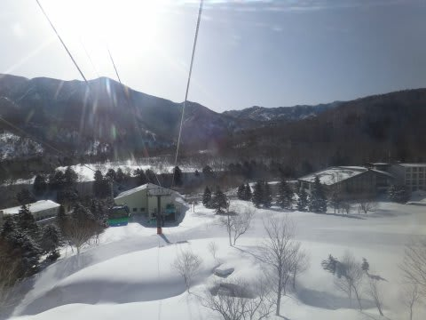
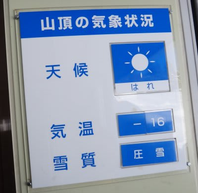
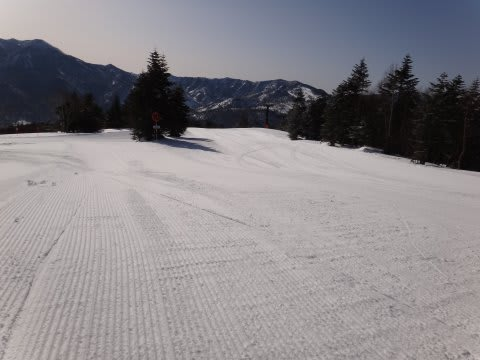
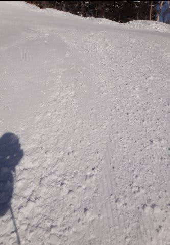
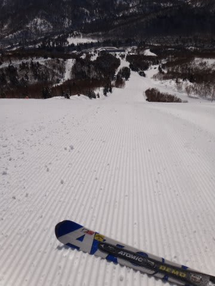
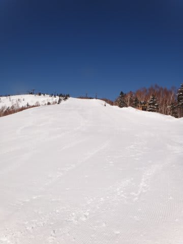
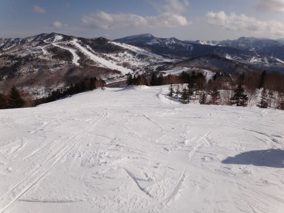

# 飛び石4連休最終日，3月20日の志賀高原は…

📅 投稿日時: 2012-03-21 00:11:26

🏷️ カテゴリ: [2012スキー滑走日記](cca3a0e9524e0203150f790b1fc3c71ad.md)

えー．

疲れてます．

さっき帰宅したんですが．

この4日間．

毎日350kmずつ，車を運転してました．4日間の走行距離，計1400km…

実は，いろいろあって前半2日で一旦家に帰ったため，

4日間で南関東の自宅から志賀に2往復したという…

んで，毎日滑走標高差10000m以上滑ってたので，

（うち2日間はナイターも…)

さすが疲れました．

さてさて．

最終日の今日ですが．

今日も朝から晴天！

さらに，とても3月下旬と思えないほど，気温も低いよ！

これはゲレンデ状態最高に違いない！

…と，ゲレンデに飛び出してみたんですが．

ありゃりゃ．

こ，これは…

バーンがちょいと固いよ～！(涙)

いや，固いというより．

氷のころころがところどころに…

いわゆるじゃがいも畑状態だな，こりゃ(泣）．

ころころに足を取られ，

ハイスピードで飛ばすには命の危険を感じたので，

セーフティーに滑ります．

うーん．せっかくの晴天朝イチ焼額なのに…

しかし．

氷のころころエリア以外は，しっかり締まった圧雪で

結構滑りいいのが救い．

オリンピックコースとかの急斜面はやっぱりアイスバーンが

出てますが，一旦上に新雪が乗ったアイスバーンは

そこそこエッジの引っ掛かりがあるので，壊滅的な状況では

なく，そこそこ楽しめます．

んで．

今日は一日春の強い日差しで．

気温も上がるかな…

と思いきや．

昼間も結構冷えてました．

最高気温がマイナス1度と，プラスに振れることはなく．

終日良い雪質がキープされ，さらさらのまま．

ねっとりした春の雪になることもなく．

この時期としては驚きのGoodな雪質．

…惜しむべくは，逆に寒すぎたせいで．

じゃがいも畑がほとんど緩むことがなく，

昼間も結構ところどころトラップになっていた

ことですかね…

しかし．

3月下旬なのに．

雪は全く緩まず，さらさら（ところどころ固いけど(涙)）雪のまま

滑ることができ．

前半2日とは打って変わった，トップシーズン並みの雪で

楽しむことができた一日でした．

ということで．

明日からはまた試乗レポート復活の予定．

## 💬 コメント一覧

### 💬 コメント by (雪上の翁)
**タイトル**: 凄い！
**投稿日**: 2012-03-21 20:06:17

昨日は良かったですみたいですね。

信州でこの時期に－16℃になるのは、

志賀と菅平くらいでしょうか？

しかし、短期間に志賀２往復とは恐るべき気力と体力、そして経済力！

そして連日の標高差1万m超え、、、

真似できません(゜o゜;;

### 💬 コメント by (Skier_S)
**タイトル**: 志賀2往復の方が安かった…
**投稿日**: 2012-03-22 00:18:56

実は，いろいろ計算して

志賀3泊4日より，1泊2日x2の方が

安くつくという計算もあったりしました…

しかし，この時期のマイナス16度は想定外の寒さでした．

さすがの娘も

「寒いからスキーしない」

という始末…

とりあえず，いろいろあった4日間でした！

