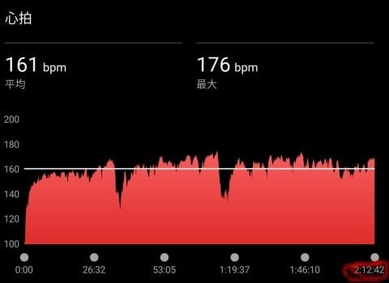
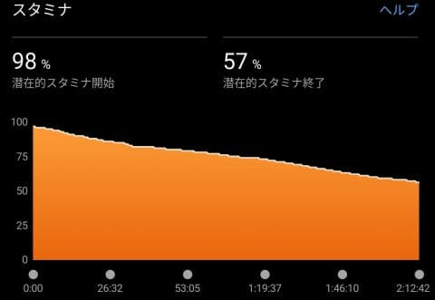
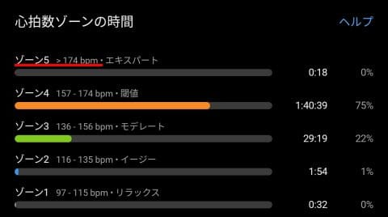
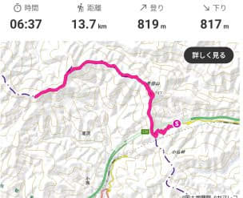
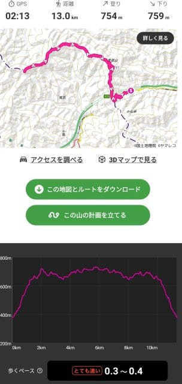
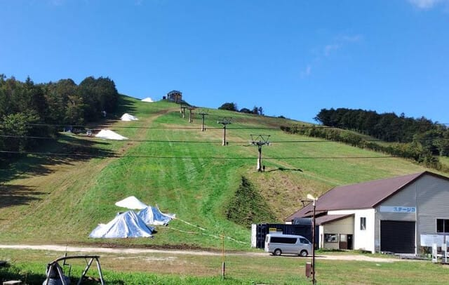
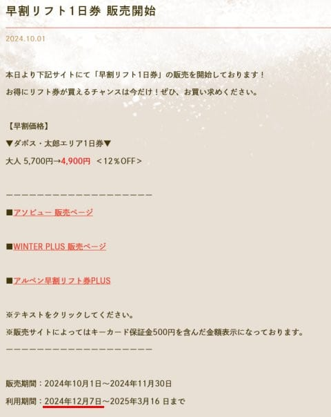
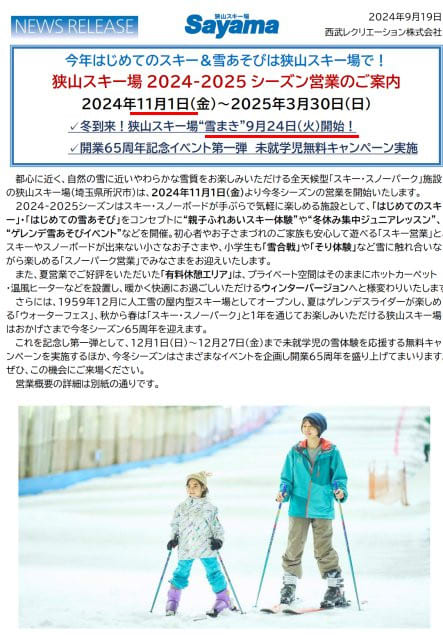
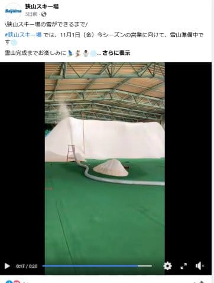

# もう10月？スキーシーズン突入の月じゃないか！狭山スキー場は11月1日オープン確定．菅平スキー場，狭山は造雪開始！イエティオープン日はまだ未定

📅 投稿日時: 2024-10-02 02:51:33

えー．

私にサヨナラの挨拶も告げないまま，

激務の9月が立ち去ってしまったようで．

そして，私に来訪を告げないまま，

気づいたら勝手に10月が我が家に

やってきてました…

いや．

しかし．

私の9月，どこに行ったんだ？？

というくらい，毎週末どこにも行けず，

何もできない9月だった…（涙）

8月のダブル夏休みの反動か，この9月は

山歩きにも行けてないし．

せいぜい2回ほど，いつもの小仏からの

2時間ほど走りに行っただけ．

ただ…どこにも行けない怒りをぶつけて

無心にがむしゃらに走ってしまったからか．

いつもの平均心拍150を大きく超える，

山頂休憩を含む平均心拍を161まで上げる

ハイペースで2時間12分走ってました…

…でも．運動不足の9月のわりに，

平均心拍160超えで2時間走っても

スタミナ半分も使わないくらいになってて…

さらに，どうも知らぬ間に最大心拍数も190を

超えたらしく．

ゾーン5の心拍数が174超えまで上がってました…

気温30度越えだったので，タイム的には

最高記録更新まで行かなかったけど．

標準コースタイム6時間37分らしいこのコース．

まぁ，2時間ちょいで往復できたので，

ぼちぼちのペースかな…

夏休み以降あんまり運動できてないけど，

スキーシーズンに向かって，体力は

そこまで落ちてないみたいで，ちょっと

安心…

ってなことで，本題へ．

本日，特派員から写真が送られてきたのですが…

どうやら早くも，菅平にアイスクラッシュの雪が

撒き始められているようです…！！

早い…早いよ！

まだ関東では最高気温が30℃になる予報が

出ているというのに．

この高温で一雨来たら，あっという間に

全部溶けてなくなっちゃいそうなのに…

もう造雪してるんだ…

ただ，いまだに菅平のオープン日は未定．

早割リフト券が10月1日から販売開始されるよう

だけど，利用開始は12月7日からのようなので…

アイスクラッシュのコースは普通の一日券が

使えない別料金のようですね．

（[菅平スキー場ホームページ](https://sugadaira-snowresort.com/358/)より）

とりあえず，10月上旬も続くらしい高温と，

雨に耐えてくれることを祈るばかり…

そして，オープン日が11月上旬という発表だった

狭山スキー場．

正式に，11月1日オープンと案内が出ました！！

11月2日オープンかな？と思っていたけど．

軽井沢オープンと同じ日でしたね…

（[狭山スキー場ホームページ](https://www.seibu-leisure.co.jp/ski_web/pdf/ski2024-2025_release.pdf)より）

で．

どうやら9月24日から造雪を始めているようで…

すでにコースに雪山が作られている写真が

Facebookに載ってますね…！

（[狭山スキー場Facebook](https://www.facebook.com/sayamaski/?locale=ja_JP)より）

そして，肝心のイエティですが．

相変わらず，オープン日はまだ全く公開されて

おらず．造雪の状況もSNSで公開されてません…

うーん．

おそらく10月25日オープンだろうなぁ…

ということで．

そろそろスキー場の造雪も始まる時期となり，

あと1か月以内で，イエティ，軽井沢，狭山が

オープンするという10月になったので．

そろそろ体力づくりしないと…

というより．

いろんな仕事に早くけりをつけて，

ちゃんと週末休めるようにしないと

いけないな…

と，10月になったという事実を目の当たりに

して，改めて認識した，Skier_Sだったの

でした…

…ホントにスキーシーズン，ちゃんと休める

のかな…（涙）
