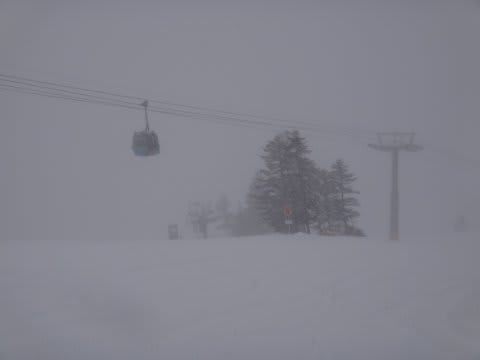
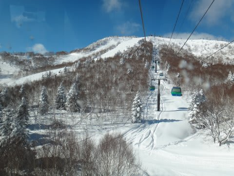

# 焼額山スキー場に通って身についてしまった，意味のない能力

📅 投稿日時: 2013-02-27 03:04:43

🏷️ カテゴリ: [日記](cc4b5682fb7b8b144980957a978653fb0.md)

えー．

今シーズンの志賀高原滑走日数31日のSkier_Sです．

これだけ志賀高原に通って．

それも，ほとんどが焼額を滑っている，

…となると．

あまり役立たない，わけの分からん感覚が身につくわけで．

先日の，すごく吹雪いた日の焼額第1ゴンドラにて．

乗り合わせた人A「外がぜんぜん見えないなぁ．あとどのくらいで到着かなぁ」

乗り合わせた人B「今の支柱にNo.9って書いてあったけど，全部で30本くらい？1/3ってとこじゃない？」

…よせば良いのに，ここで思わず口を出してしまうSkier_S．

Skier_S「支柱は全部で21本なので…大体半分来たところですよ」（…余計なお世話だったか…）

A,B「あ，そうですか…」

…その後，しばらくして

A「あー．もうすぐ着くかな～．支柱通過したけど，視界が悪くて何本目か見えなかったなぁ…」

…ここでまた，思わず口を出してしまう，Skier_S．

Skier_S「さっき通過した支柱が20本目です，その次の21本目を通過したらすぐゴールです…」

A「え？…よ，よくわかりますね～（なんだ？こいつは？？）」

Skier_S「……な，何度も乗ってますから…（汗）」

　(…また余計なお世話をしてしまったか…）

そうなのだ．

シーズンで500回以上乗る焼額第1ゴンドラ．

外が見えなくても，どのあたりを通過しているか，

感覚で分かってしまうのだ．

18本目以降の支柱なら，通過音を聞いただけで何本目か分かってしまうのだ．

寝ていても，最後の21本目の支柱の通過音で，無意識に「あ，着いた」と

体が反応するようになってしまっているという…

…毎週焼額に通っている私．

スキーがうまくならず，

なんの役に立たない，こんな特殊技能だけが身についていくのだった…(涙)
