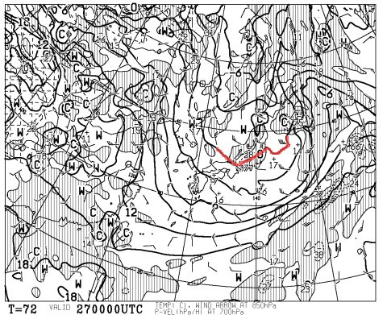
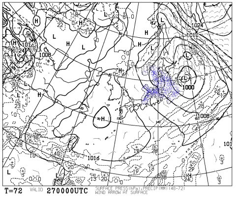
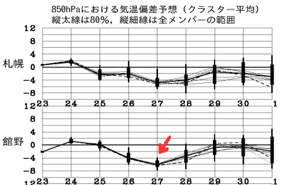
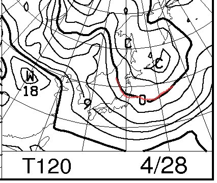
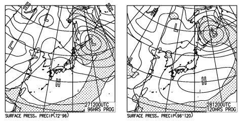
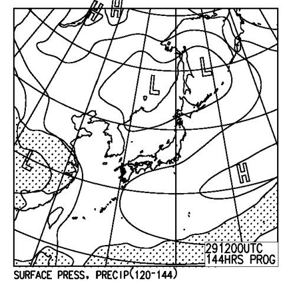

# GW前半の志賀高原の天気やいかに？

📅 投稿日時: 2013-04-25 00:48:47

えー．

なんだか，志賀高原は．

雪解けで，一の瀬山の神の営業を終えたみたいですね．

一の瀬と焼額の行き来ができなくなるのでショック…(涙)．

昨年より1週間早いですね…(悲）．

まぁ．

でも．この週末．

ゴールデンな週間がやってくるらしいのですが．

…当然，模範的スキー中毒患者としては，

GWもひたすらスキーし続けなくてはならないわけで．

そうなると，GWの天気やいかに…と，気になるところで．

とりあえず，GW前半の予想図は出ているので．

GW前半，3連休の天気を占ってみましょうか…

まず，3連休初日，27日ですが…

うむ？

850hpa面の0度線が，志賀高原より南に下がっている！

そして…

青く塗った降水域が，冬型の気圧配置の時のように日本海側にかかっているじゃないですか！

…これは．

この予想天気図どおりなら．

3連休初日の朝，雪でスタートです！

…志賀草津道，あさってオープン予定ですが，いきなり土曜朝は

積雪で通行止めの可能性も！？

こんな感じで，3連休初日の27日の気温は，平年比-6度ほど低くなるようですが．

だけど…

28日の850hpa0度線，志賀高原より北に上がっちゃうので，

まぁ，気温はプラスに振れますね～．

そして…

地上天気図はこんな感じなので，27日は曇り時々弱い雪(タイミングが悪いと霙～雨になるかも)．

28日は基本的に晴れそう．

だもんで，

27日朝は，朝は雪が降り，新雪がうっすら積もって，冷え込んだいいコンディション．

終日比較的低めの気温のため，この時期としてはまぁまぁの状況かな～．

28日は，終日晴れ．気温は例年より低いけど…

早朝は雪が硬くしまってるかもしれないけど，午前早々に

緩み始め，昼には日差しで春の雪になるでしょう．

29日最終日は…

なんだか，太平洋に高気圧が居座り，「夏か？」って思わせる天気図ですね…

だもんで，晴れます．この日も強い日差しが終日降り注ぎます．

気温は平年並みですが．

この時期の平年並みの気温で晴れってことは．

まぁ，雪はドボドボの溶け溶け雪になりそう…

という感じで．

3日間のうち，初日は結構よさそうな感じ．

少なくとも，この3連休．

志賀高原の雪は十分もつでしょう！
