# 4月24日，日曜の志賀高原詳細モードその１…一の瀬，横手山の状況

📅 投稿日時: 2016-04-26 03:35:44

🏷️ カテゴリ: [2016スキー滑走日記](c70c67ed5248e9432b899dcd5747048bb.md)

えー．

奥志賀も横手山も営業終了したというのに．

どうやら本日，一の瀬ファミリーのリフトがまだ

営業しているようですね…

この状態で，すごいことです…

んで．

高天ヶ原も，29日から営業再開予定…となってますが．

ホントかっ！？？？

とりあえず，雪不足によるゲレンデコンディション悪化のため．

本日以降は，一の瀬・高天ヶ原の中央エリアは

[一日券が1500円になる](http://www.shigakogen-ski.com/lift-operation/detail?place-id=12)ようで…

しかし．

27～28日にかけての雨が．

かなりの豪雨になりそうなため．

…一の瀬＆高天ヶ原が29日まで滑れる確率は，

限りなくゼロである…

と，予告しておきましょう．

…で．

27，28日に壊滅的な雨でかなりやばい志賀高原．

29日の夜に雪になって．

ゲレンデ状況が改善するほどの雪ではないのに．

30日朝は，うっすら積雪＆凍結路面になっちゃう

可能性も…

うーむ．

今シーズンの天気．

どうにかならんものか…（涙）．

ってことで．

日曜の詳細モードに行くわけですが．

…今日もご無体時間に帰宅して．

Blogを書く時間が取れない（涙）←いや，書いてるんですけど…

だもんで．

写真たっぷり＆ショート解説．

本日は前半，一の瀬＆横手まで．

明日は，来週まで営業予定の渋峠＆熊の湯詳細版をお送りします～．

ってことで．

日曜朝，晴天の一の瀬からスタートしたわけですが…

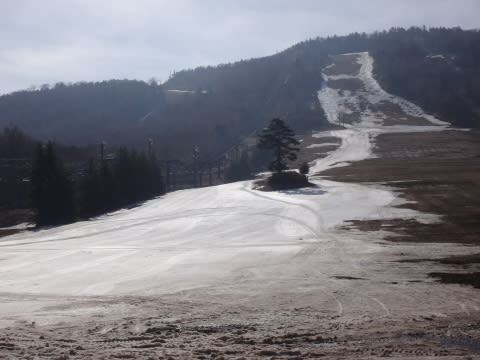

当然，上半分はもう終わっていて．

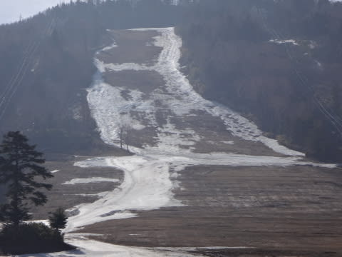

滑れるのは下半分のみです…

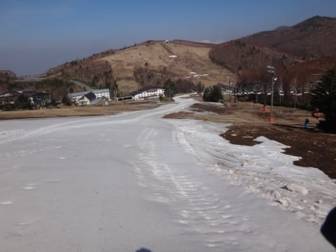

朝イチ，誰も滑ってません（笑）

一応，シマシマ（？）がかすかに残ってます…

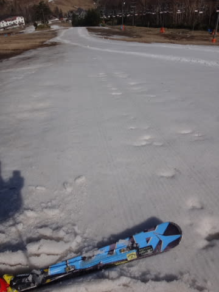

もう，コースは完全廊下状態．

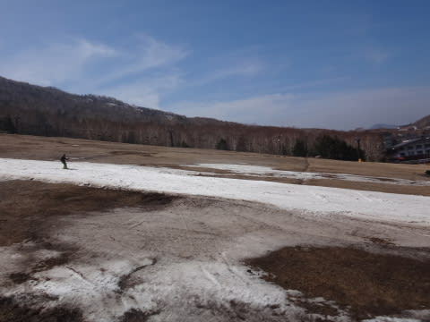

リフトも，ペアリフトの短い側のみです…（涙）．

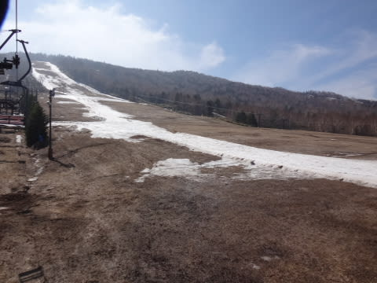

緩斜面真ん中に生えている木から下は，

ちょっと幅が広いですが…

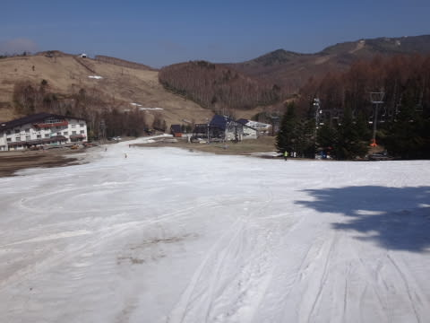

この部分，すごいゆるいので．

直滑降するしかない感じ…

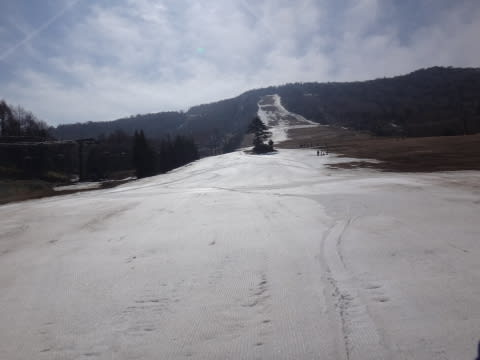

上の写真では広く見えるけど，この部分を遠くから見ると…

こんな感じ．

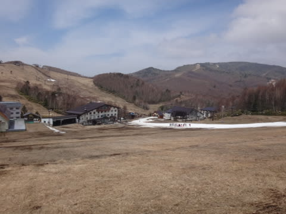

うむ．やっぱり廊下ですな．

…しかし…

それでもやるのね，試乗会(笑)

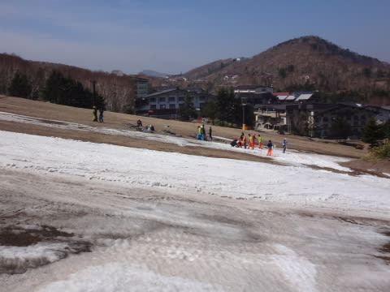

11時過ぎには，こんななっちゃったので

もう試乗どころじゃないんですけど…

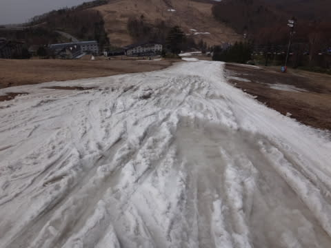

ってことなので，12時くらいには試乗は終わっちゃってました…

あまりにも一の瀬のゲレンデ状態が終末状態を迎えていたので．

もう，滑ろうという人はだれもおらず．

私が滑り終わったとき，すでにゲレンデのゲスト0人．

誰もいない，無人のゲレンデでリフトのみが回って

いたような状態だったのですが…

まさか，この翌日の月曜も営業していようとは…（ある意味感動）

で．

一の瀬がひどいので横手へ移動すると…

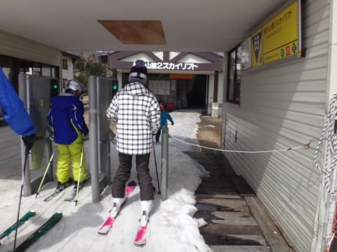

うむ．

まさか，例年5月下旬まで滑れる横手．

4月でこんなに雪が少ないとは…（涙）．

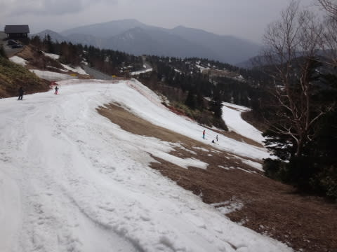

第2トリプルリフトを降りてからの部分，土が出てるし…

そして．

横手第2ゲレンデも，途中は廊下状態（泣）．

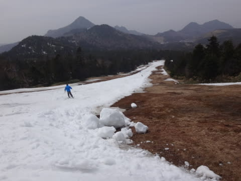

な…なんてこった．

まさか，GWの1週間前で，こんな悲惨な状況に

なろうとは…っ！！！（涙）

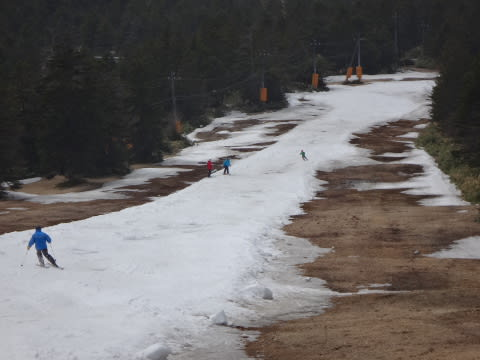

それ以外のコースも…

かなり水たまりができちゃってます．

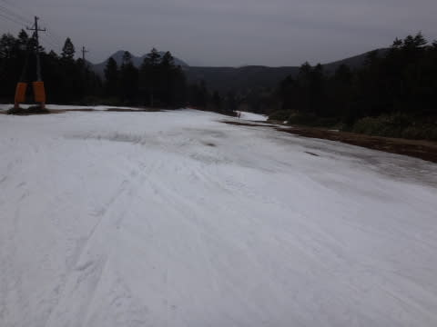

廊下部分以外，一の瀬よりは幅が広く．

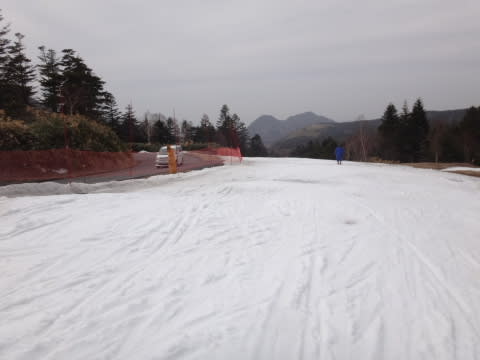

雪の量も，かなりましですけど…

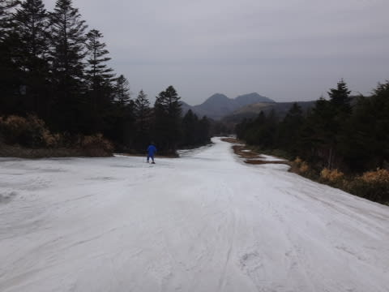

でも．

ところどころ，こんな感じに…（泣）．

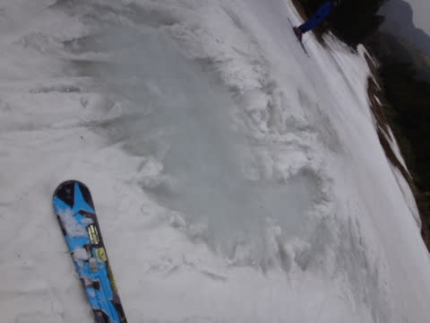

でも．

まだこれだけ雪があるので．

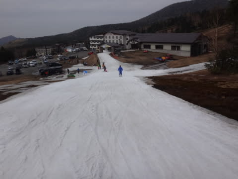

一の瀬の状況を考えたら，もう少し営業できる

気もするんですがね～…

で．

横手山頂からの下山コース，キングコースの様子を見に，

第3リフトに乗りますが…

まだ，板を履いて乗れますね．

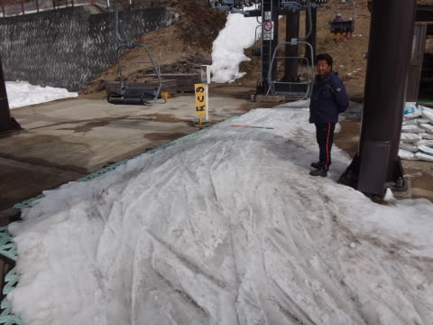

そして，パン屋さんの横を通って，下山コースに

入りますが…

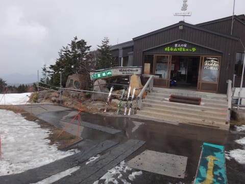

あう．

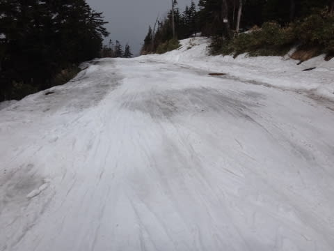

をを．

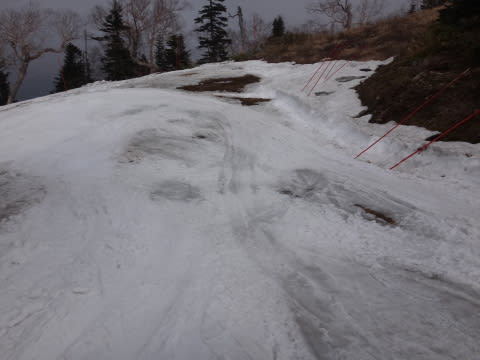

これは…

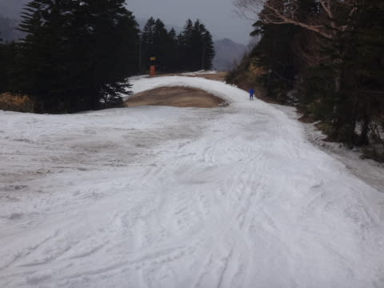

うむ．

がんばればあと2-3日営業できそうな気もするけど．

基本的に，GWまでは厳しそうですね…

ってことで．

残念ながら，横手山は，この日曜で終了です…

あぁ…

終わるのが早すぎる…（泣）．

というわけで．

来週も営業する，渋峠＆熊の湯の詳細レポートは，

また明日に続きますので，

しばしお待ちを…

＃こんなBlog書いてる暇がないはずなのに…

## 💬 コメント一覧

### 💬 コメント by (はなげ親分)
**タイトル**: う～ん!!
**投稿日**: 2016-04-26 14:32:33

日曜日の日帰りの予定でしたが、悲惨なゲレンデのレポートを読んで、心折れました(泣)

心新たに、GWに参加します(大丈夫なのだろうか…)

### 💬 コメント by (通りすがりのもの)
**タイトル**: Unknown
**投稿日**: 2016-04-26 19:30:33

初めまして

志賀高原索道協会の会議はもしかしたら

「一ノ瀬………き奇跡の雪を信じよう。」なのでしょうか!?  

GW雪なしはかなり痛いでしょうね

### 💬 コメント by (Goku)
**タイトル**: (>_<)
**投稿日**: 2016-04-26 20:33:14

これをスキー場と言えるのでしょうか・・・

それにしてもこの状況で試乗会が行われていたとはビックリです。

スキー場も宿も今年は10連休なのに相当の痛手ですね。

### 💬 コメント by (Skier_S)
**タイトル**: GWはどうするか…
**投稿日**: 2016-04-27 02:57:18

＞はなげ親分さま

日曜くじけて，GWですか(笑)

むしろ，GW諦めて日曜の方が，

滑れるゲレンデが多くて良かったのかも（＾＾；

GWは，熊の湯下半分だけですから…

＞通りすがりのものさま

始めまして～！

コメントありがとうございます．

奇跡の雪，29日に降るかもしれませんが…

積もらないでしょう．やっぱり．

あと3日間，一の瀬の雪がもつのか？？

＞Gokuさま

スキー場です！

板を履いて滑れれば，スキー場です！

（一の瀬のスタッフの気分を代弁）

…しかし，実際はかなり厳しいです（泣）．

GW，どうしよう…

### 💬 コメント by (通りすがりのもの)
**タイトル**: skier_sさま
**投稿日**: 2016-04-28 00:20:01

エツ!28日どしゃ降りの雨の中渋峠20000メートル

行くんですか!?

カッコいい～～男前～～

あっ独り言です…気にしないで下さい

### 💬 コメント by (Skier_S)
**タイトル**: 通りすがりのものさま
**投稿日**: 2016-04-28 01:33:21

28日平日ですし（＾＾；

そもそも，あの遅いペアリフトで20000m行くためには，

たぶん光より早く滑って，

リフト降りた時間より過去の時間にさかのぼって

リフトに乗らないと無理です(笑)

