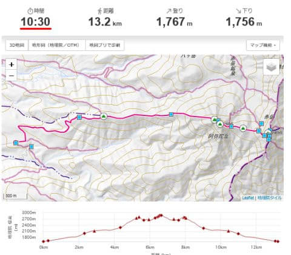

# 八ヶ岳の阿弥陀岳・赤岳ピストン登山！その1…阿弥陀岳に2回登るなんて，バカとしか言いようがないプラン立てちゃった…

📅 投稿日時: 2022-09-21 02:07:21

今日はちょっとVAAMの記事の続きを書く

精神力が無かったので，

（この記事を書くにはかなりの時間がかかります…（涙））

山登りの記事を書いたのですが…

こういう記事を書いていると…

あぁ…山に行きたい…

久しぶりに自然に触れたい…

というか．

それ以前に．

休みたい．

休みたいぞ！！

休みの日もずっと家で宿題をする日々が

もう一か月続いてて．

…そろそろ1日でいいから，ゆっくりしたい…

実質，8月も仕事や宿題を全くせずに

済んだ日は1日だけ．

9月は完全に0になりそう（泣）．

こんな状況で，スキーシーズンまでに

土日休めるようになるのかな…（恐怖）

とりあえず．

自分に言っておこう．

こんなBlog書いてる場合か！！？←それでも書くんだね…

ってなことで，本題へ．

まだ山に行く時間が取れていた

平和な時代の山歩きレポートです…！！

ーーーー

丹沢山，二ノ塔＆三ノ塔経由塔ヶ岳，蛭ヶ岳…

と，3週連続で丹沢山系で，

昼には家に戻って仕事ができるよう，

午前10時までに下山する

というハードな登山を続けてきたわけですが…

4週目となる7月最終週．

久しぶりに，

一日休んでも何とかなりそう…

という週末になりそうだったので．

少しは遠征して，本格的な山を歩いて

こよう…と．

どこに行くか計画していたわけですが…

どうもこの週末は，日曜が悪天候で

行くなら土曜．

…土曜だと，金曜深夜まで仕事して

また2-3時間睡眠で出発になるから，

あんまり遠くまで行けないなぁ…

そしてこの日は群馬方面は天気が悪そうで．

山梨方面ならギリギリ何とか…

ということだったので．

悩んだあげく．

「暑いから，そこそこ標高が高い山に

登りたい！」

「森林限界を超えた，本格的な山を

歩きたい！」

という2点から．

我が家から車で3時間程度で行ける，

八ヶ岳の赤岳に行くことにしたんですが…

赤岳だけ登るのももったいない．

南北の八ヶ岳で登ったことがないのは，

あとは阿弥陀岳なので．

阿弥陀岳には登っておきたいな…

と，阿弥陀岳＆赤岳に行くことにしたわけで．

選んだのが，この船山十字路スタートの

ピストンルート．

コースタイム10時間30分ですか…

常識的な人なら，

阿弥陀岳→赤岳→阿弥陀岳と

阿弥陀岳に2回登らなきゃならない

船山十字路スタートで赤岳に登ろうなんて

思わず．

矢印の美濃戸口スタートを選ぶと思います…

多少距離はありますが，こっちの方が

阿弥陀岳から赤岳に登った後，

阿弥陀岳に登り返さずに下山できるので，

標準コースタイム10時間22分と，

こっちの方が赤矢印の船山十字路

スタートより短いです…

では．

なぜ今回，船山十字路スタートを選んだのか？

…それは．

私は人が少ないルートが好きなので，

人が多い美濃戸ルートを避けたかったのと．

…金曜の深夜に仕事を終えてから

ほぼ徹夜で登りに行くことになるし．

昼過ぎには天気も崩れる予報だったので．

50%くらいの確率で，

「阿弥陀岳で帰ろう～」

となるかもしれず．

赤岳まで行かず，阿弥陀岳往復なら，

美濃戸口より，船山十字路スタートの方が

往復コースタイムが1時間ほど短い

という，二つの理由で，赤矢印の美濃戸口

スタートではなく，この船山十字路スタートを

選んだのでした…

しかし．

この時は．

「阿弥陀岳に2回登るルート選ぶなんて，バカだ…」

と，後でさんざん後悔することを知らなかった

のだった…

（続く）

## 💬 コメント一覧

### 💬 コメント by (真美子)
**タイトル**: Unknown
**投稿日**: 2022-09-21 16:21:28

2022ー2023の長期予報で、雪が降るか降らないかのブログになると思っていたら、八ヶ岳の話だったわー。

### 💬 コメント by (Skier_S)
**タイトル**: >真美子さま
**投稿日**: 2022-09-22 04:04:19

長期予報の記事を書くために，資料を読み込む精神力が無かったので，記事にしなかったのですが…

天の声が聞こえたので，記事にしました～！！

（…別に長期予想の記事を所望していたわけではなかったのかもしれませんが…）

