# 2022年10月，谷川岳→茂倉岳に登ってみた…その4，谷川岳山頂到着！

📅 投稿日時: 2023-08-27 01:37:14

ダメです．

仕事が大炎上中（涙）

なのに，夏休みボケなのか…素早く適切な

手を打てず，いろいろ後手に回っている

ヤバい状況．

ヤバい．

だもんで金曜夜から土曜は必死に仕事を

していたけど（なので昨晩は記事の更新ができなかった），

月曜昼までにやらないとヤバい仕事が終わらない…

それなのに．

この週末は娘の夏休み最後の土日ということもあり．

月曜朝の自分にすべてを任せ，日曜に娘と

遊びに行こうという…

大丈夫か？＞自分

そんな状況の中，2日続けて更新無しはダメだと，

Blogを更新しているという…

大丈夫か？＞自分again

ってなことで．

今日は谷川岳レポートの続きです！

ーーー

（[前回](e71c1adff190d2f3ab7c56385825dc343.md)から続く）

ってなことで．

通り過ぎたラクダの背を後ろに見ながら…

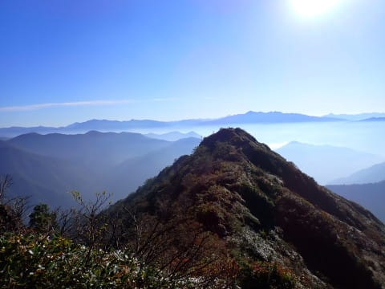

ラストスパート（といってもあと1時間くらい…）

の急登部分を登っていくわけですが．

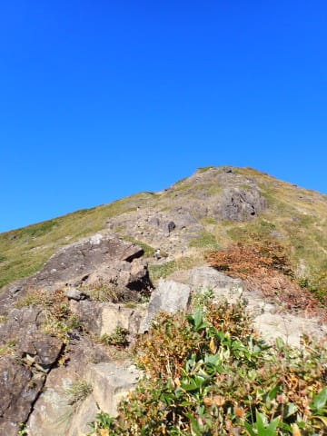

斜度感がわかりにくいですが，

このくらいの急斜面．

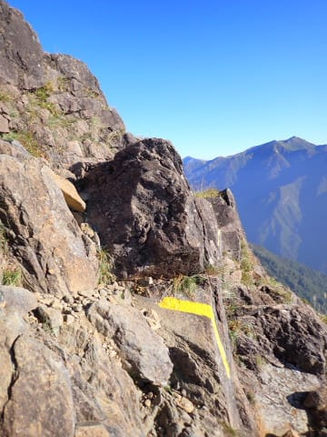

こういう斜度がかなりの距離続く

所を登っていきます…

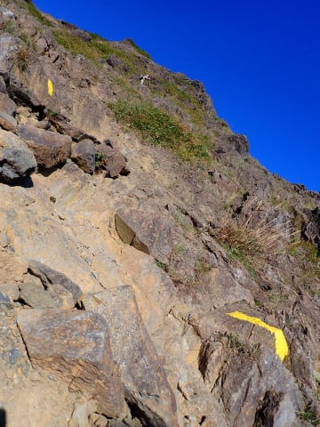

ところどころ鎖もあり．

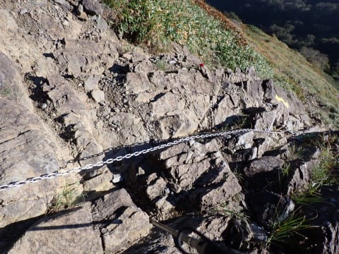

ちょっと気を付けないといけない箇所も

何か所かありますが…

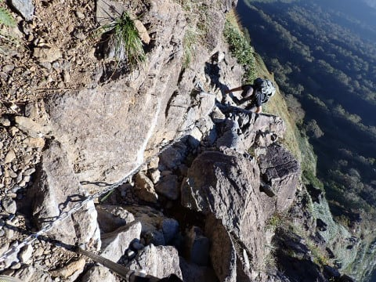

もう少し激しいコースを予想してたけど．

予想よりは激しくないかな…

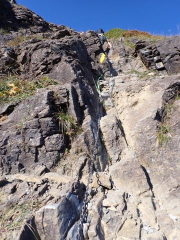

まぁ，比較するのもあれですが．

妙義山よりは怖くない感じ．

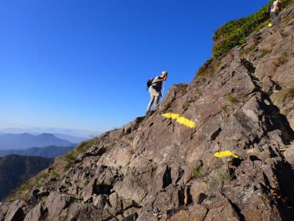

こんな感じで．急斜面を登っていくこと

しばし…

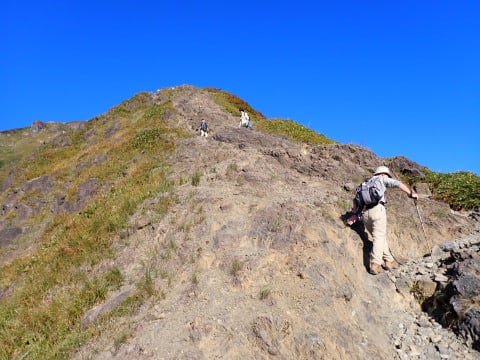

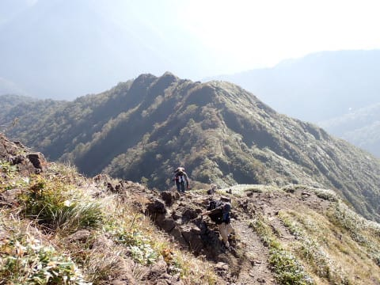

狭い急斜面を超えると．

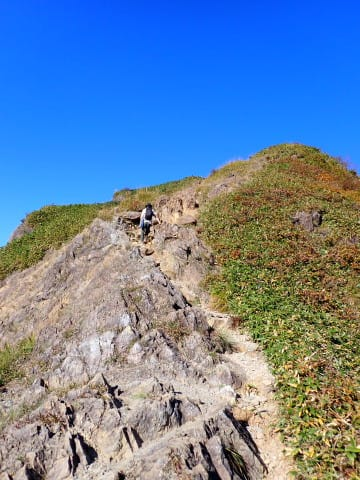

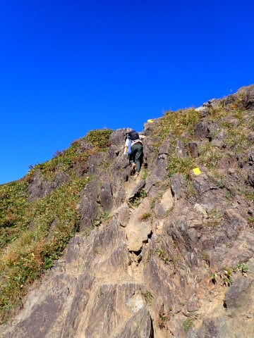

もう山頂…！！

と言いたいところですが．

まだもう少しあるのね…（涙）

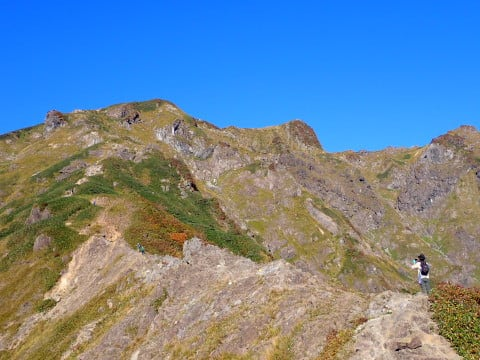

でも，山頂はもうすぐ！

まだ終盤にも，鎖場やらロープやらが

ありますが…

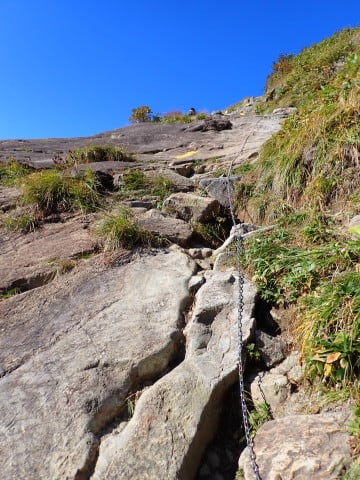

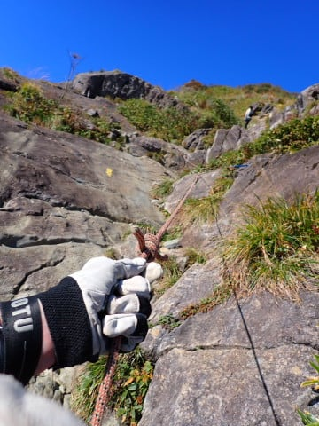

絶景を眺めつつのラストスパートで…

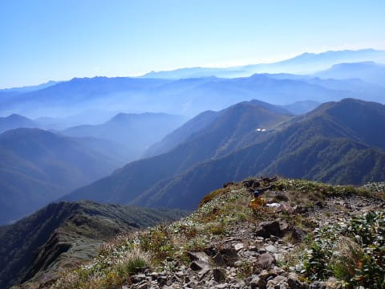

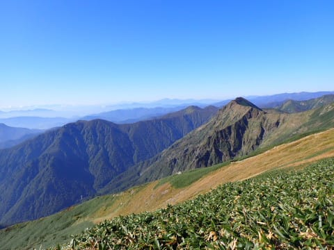

肩の小屋のそばを通ると．

あとは緩やかな登りを歩いて．

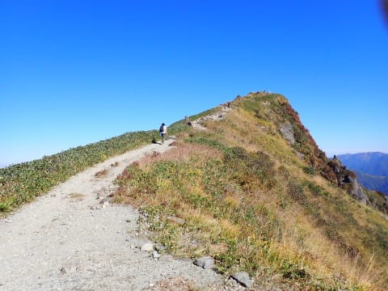

谷川岳，トマノ耳へ到着！！！

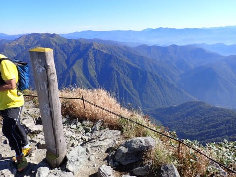

スタートからここまで2時間42分．

2時間半狙いだったけど，

15分近くオーバーしちゃったか…

（この写真を撮ったのは山頂到着2分後）

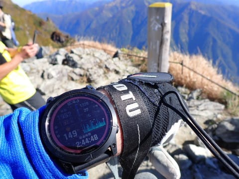

でも．

ここまで来てみた感想としては．

日本3大急登といわれるだけあって，

さすがに結構な急斜面が長い距離

続きましたが．

もっともっと体力的に厳しいかと思ったら，

３時間かからず登ってこれる距離なので，

まだまだ体力も大量に残っている感じ！

だもんで．

一休みしたら，ここからまだ

一ノ倉を越えて，茂倉岳まで向かいますよ～！！

（[続く](ea4fb310fb7e9cfe317e50fde4fdacdac.md)）

## 💬 コメント一覧

### 💬 コメント by (ねも)
**タイトル**: Unknown
**投稿日**: 2023-09-07 06:39:28

Ｓさん　お久しぶり(^^;)

私も10年近く前に一度だけ、西黒尾根を登りました。何だかロープウェイが点検のため休業で、ならば混まないでしょうという同行者のレアな理由😅　あのロープウェイは3000円もするのですか(@_@)

蓬峠で泊まり翌日は反対側の朝日岳や白毛門を歩きました(いわゆる馬蹄形縦走)　忘れられない山旅です(^o^)

遊んでくれるお嬢さんがいてハッピーですね。超うらやましがられるでしょう？

わが娘も(26歳です)誘えばどこでも着いてきます✌️

### 💬 コメント by (Skier_S)
**タイトル**: ＞ねもさま
**投稿日**: 2023-09-08 01:04:05

今は谷川岳ロープウェイ，往復3000円です…

昔はもっと安かったんですが．

私も谷川岳馬蹄形やりたいと思っています…ただ私の場合は日帰りですが(笑)．

娘は時々一緒に遊んでくれますが，学校が土曜休みじゃなく，日曜も宿題やったり

なんだりでほとんど遊ぶ機会はないです…（涙）

