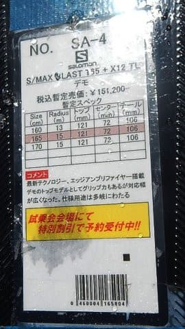

# ついに開始！2019シーズンのスキー板，試乗レポート第1回…SALOMON編その1

📅 投稿日時: 2018-03-30 03:57:16

🏷️ カテゴリ: [スキー板試乗](c0bd8048615710cee890e403a36cc9a2b.md)

えー．

全国93億7000万人のSkier_S試乗レポートファンの皆さま，

お待たせしました←地球上の人口より多いから

…お待たせしました

あえてもう一度．

お待たせしました

…待っていた人がいるはず…

と信じて．

ええ．ついに始まりますよ～．

2019シーズンモデルの，スキー板の試乗レポートです！

ってなわけで．

まず．

いつもの注意事項から…

この試乗レポートを書いているのは，

テククラも持っていなければ，指導員資格などもなく．

検定？大会？なにそれ？…といった感じで．

熱心に技術向上を目指しているスキーヤーからは

ほど遠い，お気楽レジャースキーヤーです（笑）．

私が「これ，いい！」とホメた板でも，他の人には

「なぜ，この板を誉める…」ってのもあるでしょうし．

その逆に，私が気に入らなかった板でも，他の人には

すごくいい板もあると思いますので．

あくまで，素人レジャースキーヤーの個人的感想ということで

読んでやってください．

ちなみに，私は

・体格的には，中肉中背

・比較的滑走スピードは高い方だと思う…結構張りの強い

　板をたわませて滑るのが好き

・グリップが強め，すっとたわむけど，

　比較的強い返りがある，ばね感の強い板が好み

・基礎小回り板が好き．ATOMIC Bluester SX 165cmを愛している

という感じなので，ご参考までに．

この板を試乗した日は，雪質もまぁまぁ．

フラットな斜面を，比較的ハイスピードで

試せる条件でした…

では，今シーズン第1回目の試乗レポート，

SALOMONからです～！

○SALOMON SALOMON S/MAX BLAST 165cm 

基礎オールラウンド

エキスパート向けS/MAXシリーズの最高機種．

今シーズンモデルで言えば，X-MAX 14に匹敵するのかな…？

165cmでR15という，小回りでも大回りでもどちらでも

行けそうなサイドカーブの板．

来シーズンのSALOMONは，このプレートみたいな感じの，

「エッジアンプリファイヤー」

とかいう構造が売りみたいですが…

ビンディングは，去年の軽量なXTビンディングから，

変わって．

Xビンディングのヒールピース＆トゥピースを

流用して，Z12TLビンディングのブーツサイズ可変機構を

組み合わせた「X12TL」というビンディングになりました…

これは，ATOMICのX12TLと全く同じビンディングですね．

当然，ガッツリ重量級のXビンディングベースなので．

このビンディング，結構重いです…

で．

板自体もずっしりと重く．

昨年までの，ありえないほど軽量だったX-MAXとは

対極に行ってしまった感じの重さ．

滑ってみても，ちょっと重め…．

けど，重いので安定感はあります．

この板を履いた時は，午後の雪が緩んだタイミングで，

ザラメの緩んだ春雪だったのですが．

かなりどっしりとした感じで，荒れた春雪を

蹴散らしていくような板．

どっしりしているので，スピードを出しても安定感はあるけど…

この板でコブに入るのはちょっと避けたい重さ．

かなり足にずっしり来るので，

軽快に振り回すのは難しいです．

板自体のフレックスも，S/MAXシリーズの

最上級グレードだけあって，かなり強いです．

春の柔らかい雪ではたわませきれない感じ…．

板がたわませられなかったので，板の返りも

それほど感じられず，サイドカーブに乗って

落ちていく感じ．

荷重ポイントはサロモンらしい，かかと側．

エッジグリップが結構強く，スイングウェイトも

重いので，ズラシというよりエッジなりに乗って

行く感じになります．

かなり固めの斜面で，技術＆体力がある人が

高いスピードでしっかり板を抑えて滑っていく

板なんだろうなぁ…って感じです．

うーむ．

今シーズンモデルのX-MAXの後継機と思って履いてみたら．

S/MAX BLASTは全然違う板になっちゃいましたね．

他のS/MAX 12以下のシリーズは今回乗ってないのですが．

S/MAX BLASTだけが重量級になったのかな～？？
