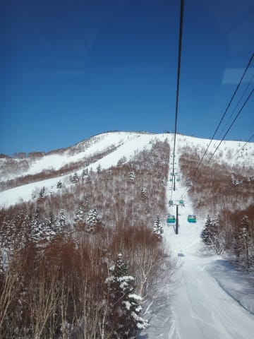
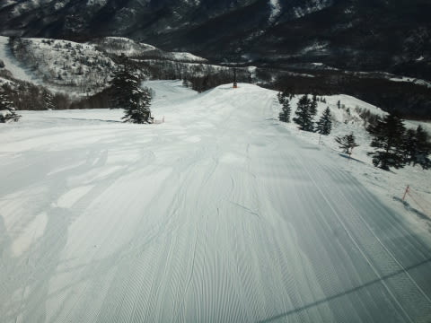
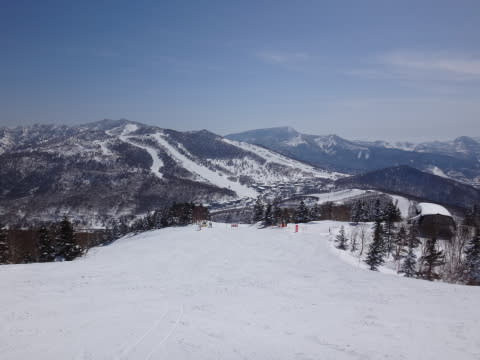
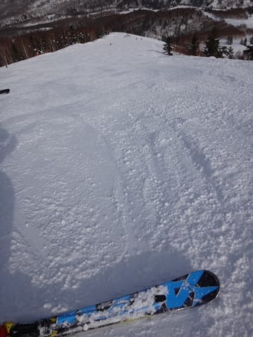
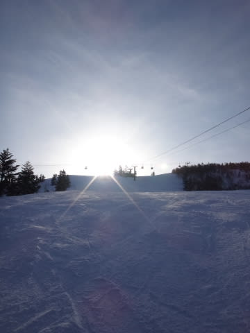

# 3月15日の志賀高原，速報モード…最高．言うことなし！

📅 投稿日時: 2015-03-16 00:21:49

今日も．

あまりにも最高のコンディションすぎたので．

ガッツリ最後まで滑ってしまいました…！←コンディションが良くなくても最後まで滑ってるのでは？？

ってことで．

いつも通りの深夜帰宅パターンなので．

今日も速報モードで…

えーーー．

本日は．

というより，本日も．

超快晴のピカピカ晴天で始まりました～！

朝イチのゲレンデは…

もう，これ以上何を望むものがあるというのかっ！？？

って感じで．

最高の雪質で，固くもなく柔らかくもなく．

最適の硬さの，ピカピカシマシマ

ベストコンディションバーン！

午前中は，ちょいとゲレンデの人は多めだったものの…

天気は午後まですっきり晴れが続き．

気温はちょっと上がったものの．

夕方のリフトストップまで，予想よりいい雪質の

フラットバーンが続き…

リフトストップまで，たっぷり満足の一日でした～！

いやーー．

3月中旬というのに．

これだけ素晴らしい一日だったのは．

間違いありません．

私の日ごろの行いの良さを，神様が…（サクッ）←神様の怒りの天誅

PS.マルハバさん，Gokuさん，ご一緒ありがとうございました～

## 💬 コメント一覧

### 💬 コメント by (Goku)
**タイトル**: Unknown
**投稿日**: 2015-03-16 18:39:51

いやいや、昨日はサイコー！でしたね。

2本しかご一緒できませんでしたが・・・（ラス１はスミマセン）

３月半ばでこんなグッドコンディションなヤケビもそうそうないでしょう。（いや？あったか）

毎週こんなのが続くとイイですね。

### 💬 コメント by (Skier_S)
**タイトル**: Gokuさま
**投稿日**: 2015-03-17 00:56:30

もう，ホントに最高でしたね～！

朝イチはまさしく今シーズン最高だったのでは？？

毎週，こんな感じであってほしいなぁ～．

しかし，昨日は太ももだけじゃなく背筋にも来てて，

体中がギシギシ言ってました…

満足な週末でした！

