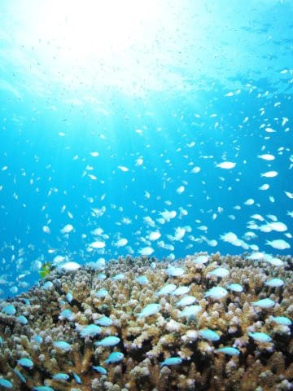
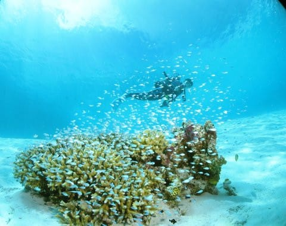
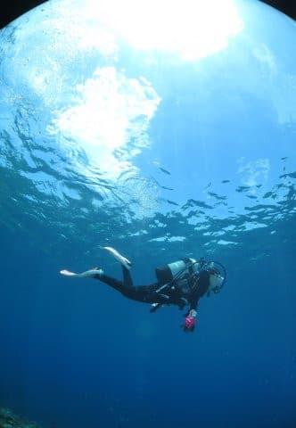
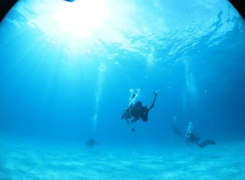
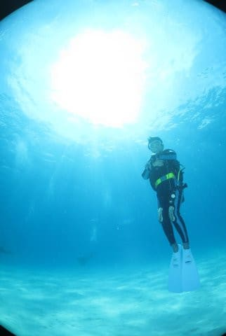
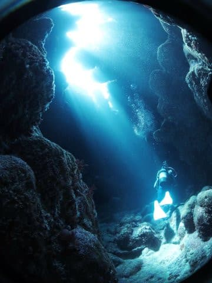
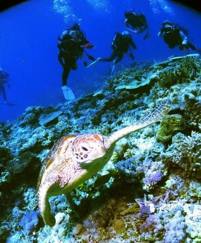

# 2023年8月，座間味で親子3世代ダイビング！プロローグ…コロナ明けで4年ぶりのダイビングへ

📅 投稿日時: 2023-09-05 03:43:28

ということで…

この夏休み．

コロナ禍始まって以来，長らく中断

していたダイビング旅行を復活させ，

実に4年ぶりのダイビングに行って

きたわけですが．

ここ3年ほど，いつもに輪をかけての仕事の

ご無体が続いているので．

今年，ホントに夏休み取れるのか…？？

と，心配になりながらも．

お盆時期はほかの人も休むから，

突然の宿題はやってこないはずだ

と信じ，GWごろには夏休みの飛行機や

宿を抑え…

何とか予定通り，無事休みを取ることができ，

久しぶりのダイビングを堪能してきました～！！

いやー．

ホントに久しぶり…

最後に行ったのが，[2019年8月のモアルボアル](e4666ecaa249cd80437ec5b792e3d2a3a.md)で．

そのころはまだ娘は小学生！

その前の年，10歳になってCカードを

取れるようになった，[小学校5年の夏に
モアルボアルでCカードを取得](e308d9a01caec22968e6edff28fd5e5bc.md)し，

モアルボアルと座間味で15本ほど潜り．

翌年の小学校6年生の夏にも，モアルボアルと

座間味で15本ほど潜ったわけですが…

結構珍しがられた小学生ダイバーだった

娘は，30本潜っただけで，

その後コロナ禍で中学の3年間全く潜れず．

中学生ダイバーを吹っ飛ばして，

初心者のまま，ブランク4年の高校生

ダイバーとして，今年から復活することに

なったわけですが．

娘だけではなく，私も実に4年ぶりの

ダイビングになるわけで．

今回，円安が進んだうえにコロナ禍の影響で

飛行機の便数が減り，海外はめちゃくちゃ高いし．

さらに久しぶりのダイビングなので，

こっちのことをよく知っているところが

安心だよね…

と，行き先は勝手知ったる座間味にして，

いつものザマミセーリングさんを利用しての

ペンション星砂さん泊まりとしました…

…かわりばえのない，行き慣れた

いつものパターンですが，

果たして，2年しか潜ってないのに

4年間のブランクが開いた娘は無事

潜れるのか…？

私もダイビングのブランクが4年間も

開いたのは初めてだし．

潜り方忘れてないか？

4年間全く撮ってない水中写真，カメラの

設定とか覚えてるか？

なんか，持っていく荷物を忘れちゃったり

しないか？

そもそも，

4年間使ってなかった器材はちゃんと

使えるのか？

…と．

いろいろ心配がある，実に久しぶりの

ダイビング旅行というのに…

なぜか今回，うちの親子3人だけではなく…

我が両親と一緒にダイビング旅行に行く

という無謀なプランを立てたのでした…！

いや．

コロナ禍で長く里帰りをしてなかったし．

この夏休みも，座間味に行っちゃったら

里帰りしてる暇はないよな…

と考えていた時．

ちょっと待て．

ダイビング旅行に両親を一緒に連れて

行けばいいんじゃない？？

…と気づいて，一緒に行くことにしたのでした…

ということで．

今回．

単に一緒に行くだけじゃなく，滅多に経験した

人はいないだろう，

親子3世代でダイビング

というチャレンジをしてみたわけですが．

果たして．

ブランクダイバーが無事潜れるのか？

というだけでなく，

高校生と古希を過ぎた3世代，無事に

一緒に潜れるのか？

というチャレンジをしてみたので．

これからじっくり旅行記を書いていきます…

果たして．

トラブルなく，無事に帰ってこれたのか…？

お楽しみに！

PS．

実は我が両親，どちらも経験本数400本を

超えるベテランダイバーだったりします

…そして，ダイビング旅行記がこのBlogで

一番人気がないコンテンツだったりする…

またアクセス数が減るんだろうな…

## 💬 コメント一覧

### 💬 コメント by (マルハバ)
**タイトル**: ご両親もダイバーだったとは・・
**投稿日**: 2023-09-05 07:38:55

それはすごい！

記事に触発されて

久々にダイビング情報を調べてみると

かつて「泣く子も黙る？」と言われた

あの SCUBAPRO が

日本から撤退しちゃってたみたいですね（驚）

ウチの重機材も十数年間スーツケースの中だけど

既に朽ち果てちゃってるかも？（汗）

### 💬 コメント by (mitsu-light)
**タイトル**: Unknown
**投稿日**: 2023-09-05 09:49:34

私は昔、夏はスキューバダイビング、冬はスキーという生活だったのでスキューバダイビングの記事も楽しみです！

### 💬 コメント by (Skier_S)
**タイトル**: ダイビング人口がすごい減った気がする
**投稿日**: 2023-09-06 00:14:17

＞マルハバさま

Sproも日本撤退していますが，Maresもかなり昔に日本撤退してますよね…

ダイビング器材のお店も，昔は新宿近辺にいっぱいあったけど今は数少なくなり，

ダイビング産業はかなり寂しくなった感…（涙）

＞mitsu-lightさま

おっと！ここにもスキーヤー＆ダイバー仲間が…

今は潜ってらっしゃらないんですか？

久しぶりに潜って，夏はやっぱりダイビングがいいなぁ~，

と再認識しました．

でも，ダイビングをする人はかなり減った感じです（泣）

### 💬 コメント by (Unknown)
**タイトル**: Unknown
**投稿日**: 2023-09-22 13:55:23

はじめまして！

現在10歳の娘がダイビングCカードをとるため頑張り中の親です。

冬はスキーというのも我が家と一緒！

と思いうれしくなりコメントさせてもらっちゃいました。

親子三世代ダイビング素敵ですね❤

明日と明後日で実習の予定です。

がんばります♪（娘が 笑）

### 💬 コメント by (Skier_S)
**タイトル**: ＞Unknownさま
**投稿日**: 2023-09-23 00:53:56

コメントありがとうございます～！！

うちと同じ，10歳でCカード取得チャレンジですか！

学科は無事終わりましたでしょうか？

もう明日，明後日で実習ということなので，もう参考にはならないかもしれませんが，

我が家のCカード取得レポートが

https://blog.goo.ne.jp/tsakamot2001/e/236c9494959781d162d4ed151333cd21

にありますので参考にして下さい！

ちなみに，我が家のCカード取得はモアルボアルで格安でやってもらえたのですが…

その時の旅行記は

https://blog.goo.ne.jp/tsakamot2001/e/308d9a01caec22968e6edff28fd5e5bc

を参考にしてください！

そして，冬はスキーですか…

ぜひ志賀高原にお越しください．

一緒に滑りましょう…！

