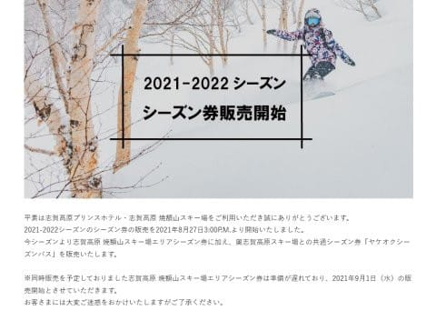
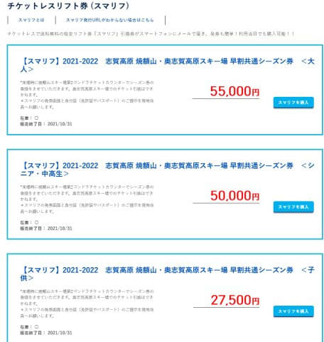

# 志賀高原，焼額＆奥志賀共通シーズン券が2022シーズンより新発売！？？

📅 投稿日時: 2021-08-28 01:41:27

🏷️ カテゴリ: [スキー雑談](c1f9d2cb7478308da16419928ea3945e9.md)

えー．

本日，m&tさんよりコメントいただいたり，

さらに焼額常連メンバーの中で，かなり活発な

情報交換があったのですが…

なんと．

2021/2022シーズンより．

志賀高原焼額山・奥志賀高原共通シーズン券

が発売になりますっ！！！！

（[焼額山スキー場ホームページ](https://www.princehotels.co.jp/ski/shiga/informations/21-22Seasonticket/2/)より）

これまで，焼額エリア単独シーズン券は

ありましたが…

仲良しの奥志賀＆焼額，ついに2スキー場の

共通シーズン券を出すようです！！！

価格は…

10月30日までに購入の早割価格で，

大人55000円，

早割シニア＆中高生で50000円，

早割ジュニアが27500円．

ですか…

（[Surf&Snowリフト券購入ページ](https://surfsnow.jp/guide/htm/r0130tk.htm)より）

27500円の小学生（ジュニア）券もありますが．

焼額は小学生無料なので，

これは実質奥志賀専用の小学生券ですね．

で．

この奥志賀＆焼額共通シーズン券ですが．

残念なことに．

早朝＆ナイターは利用できないようです

うーん．

かなり残念…

だったら，22000円高くなるけど．

中央エリアでも，熊の湯＆横手山でも使える，

77000円の全山共通シーズン券の方がいいかな…

来年も全山共通券，値上げしないでいてくれるかな？？（かなり心配）

まだ，

焼額限定シーズン券

志賀高原共通シーズン券

の情報が出てないけど．

焼額限定券は9月1日から受け付け開始で，

おそらくその時に情報が出てくると思うので．

その時のお値段と条件（ナイター＆早朝が可能か？）

によっては禁断の，

同じスキー場で使えるシーズン券2枚持ち

になる終わった人すごい人がいたりして…

いや．

私は買わないですよ．

全山共通券とヤケビ限定券という，

同じスキー場で使えるシーズン券を

2枚買うなんてこと，しないですよ．

一般常識を持った人がやってはいけないことを

やるつもりはないですから…

うん．

買わない．

買わないぞ！

買わないはず…

（超早割でヤケビ限定シーズン券が30000円を切ったらヤバい．早朝10回，ナイター2-3回で元を取っちゃう…）

## 💬 コメント一覧

### 💬 コメント by (かず)
**タイトル**: Unknown
**投稿日**: 2021-08-28 08:25:44

こんなペア出してくるなんてちょっと怪しい 笑 通常版相当高額になったりして…僕は外人さんしだいで+野沢アライなのでまだ検討です

### 💬 コメント by (ほっぽ)
**タイトル**: Unknown
**投稿日**: 2021-08-28 10:00:03

これはもう、２枚買うと宣言したようなもんですね😅

昨シーズン、ズン券４枚持ちの私が言うのも何ですが😅

### 💬 コメント by (ikkun)
**タイトル**: Unknown
**投稿日**: 2021-08-28 12:56:35

お疲れ様です 今までなかったんですね?  (  -_・)?買わない??買ったら罰金とか( *´艸｀)

### 💬 コメント by (Skier_S)
**タイトル**: 3万円切ったら考える…
**投稿日**: 2021-08-29 00:12:03

＞かずさま

志賀高原共通全山シーズン券，ものすごい値上がりしたら…泣きます．

8万円とか言われたらどうしよう…

＞ほっぽさま

いや，ヤケビ限定シーズン券，3万切ったら考えますが…

コロナがどうなるか分からず，また4月やGWが滑れないような

状況になりかねないので，ちょっとリスキーかな，と思ってます．

＞ikkunさま

いや…今まで2枚持ちしたことは，さすがにないです．

今年はコロナじゃなかったら買ってたかも．

### 💬 コメント by (yumi)
**タイトル**: Unknown
**投稿日**: 2021-08-29 00:29:08

Ｓさぁ～ん🥳⛄😍

そろそろ❣️シーズンの情報が 出回り始めましたね🎵💖🎵

ちなみに・・・

HAKUBA VALLEYのシーズン券は２万円の値上げだそうです😢

超早と早割は有りますが 12月の販売価格は ナント142000円😅

おそろしやぁ～😱😱😱

### 💬 コメント by (かず)
**タイトル**: Unknown
**投稿日**: 2021-08-29 19:54:24

Sさんは8万でも10万でも買うことになりますヨ笑笑

僕の予想は10万です！！外人さんに期待できないと厳しいでしょう…志賀を応援します！！

### 💬 コメント by (Skier_S)
**タイトル**: 志賀共通シーズン券，値上げしないことを祈るばかり…
**投稿日**: 2021-08-29 23:12:03

>yumiさま

ええええ！？？

白馬，14万2000円！？？？…それだけの金額だと，違うスキー場に行きますね…

すごい．買う人いるんですかね？？？

＞かずさま

うーん．

さすがに10万を超えたら，ヤケビ・奥志賀共通券を買って，中央エリアに行く日だけ中央エリア一日券買った方がお得かも…

って気になってます(笑)．

