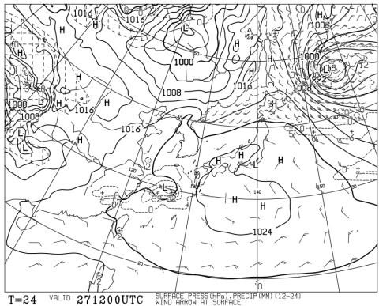

# 3月1，2日の週末の志賀高原スキー場の天気は…めちゃくちゃ気温が上がり，晴天4月の春スキーのような天気．日曜は午後に液体が降るか？

📅 投稿日時: 2025-02-27 02:27:28

🏷️ カテゴリ: [スキー天気予想](c6554f5c3c106093b511a8daae23757e8.md)

えー．

今シーズンもスキーダイエットが

確実に効いて，また体重が減っている

Skier_Sです…

いや．

滑っている間は，ただでさえ昼はパンとか

カロリーメイトとかの行動食だけで過ごして

しまううえに，

1，2月はナイターに行くので，夜ご飯までも

昼営業終了後からナイター開始までの間に，

慌ててサンドイッチとかおにぎりを

かじるだけになってしまうので…

圧倒的に摂取カロリー不足なのが原因って

のは分かってるんですが．

いや．

ホントに．

痩せたい人がいれば，朝からナイターまで

休まずに滑れば，痩せられますよ～！←普通は

健康なスポーツのはずのスキーなのに，すごい不健康に

感じるのは気のせい？？

ってなことで，本題へ．

今日は水曜深夜なので，定例の週末の

志賀高原の天気予想です…！！

いつも通りに天気図を見ると…

まず，27日(木)の850hPa図では，

うーん．

志賀高原には水色の-3℃線がかかる

レベルで，この時期としてはちょいと

気温が高め（泣）

まぁ，でもこの気温なら液体が降る心配は無し．

そして，この日の地上天気図は．

ほぼ全面高気圧に覆われるので．

暖かい晴天の一日になりそう…！

というか，昼間は0度を越える晴れ

なので，雪が緩みそう…(涙)

続く，28日(金)の850hPa図を見ると．

えええ！？？

赤い0℃線が志賀高原にかかってる…

というか，一部志賀高原近辺まで

垂れ下がってるけど，0℃線はほとんど

北海道まで北上してますよ！？？

これだと，降れば液体の危険性も

ありますが…

まだこの日も高気圧に覆われているので，

志賀高原は液体が降る心配はなさそう．

そして，肝心の週末，3月1日の850hPa

気温を，恐れつつ見るわけですが…

…うぎゃーーー！！

ダメだ！

赤い0℃線は東北地方まで北上し，

志賀高原には+3℃線がかかってます…

これだと昼間の気温が山頂でも+5℃を越え，

標高が低いところは+10℃近くまで

上がりますよ…これは…（泣）

まぁ，この日も高気圧に覆われて，

何かが降ってくることはなさそうなので．

液体が降る心配はいらなさそうなのが

救いか…

でも，昼間は4月の春スキー並みに

雪が緩みそう（泣）

で，3月2日の日曜の850hPa気温を見ると．

…この日も気温が上がりそうで，志賀高原には

水色の+6℃線がかかってます…

+6℃線が志賀にかかるって，4月下旬から5月上旬

くらいの気温なんですが！？？？

そしてこの日は，志賀高原にぎりぎり

降水域がかかってるので…

降りますね．

空から落ちてきます．

液体が…（涙）

ということで，まとめると．

2月27日(木)：朝から晴れ！終日晴れの1日．

　朝イチの気温は-10℃近くまで下がるが，

　昼間は0℃近くまで上がる．

　日差しでかなり暖かく感じる．

　朝イチはいい感じの締まったシマシマ

　バーンだけど，昼に向かい日当たりの

　いいバーンは雪が緩んでいく．

　午後遅くになると，日当たりの良い

　バーンは昼間緩んだ雪が固まって

　硬くなっていく

2月28日(金)：この日も終日晴れ！

　朝イチの気温は-3℃程度と高め．

　昼間は+3℃を越え，日当たりの良い

　ゴンドラの中とかは暑さを感じるほど．

　朝イチはいい感じの締まったシマシマ

　だけど，午前中に日当たりの良い

　バーンは緩み始める．

　午後になると，日当たりの良くない

　バーンもしっとりした感じになって

　行きそう…

3月1日(土)：この日も晴れの一日！

　朝イチの気温は-3℃ほど．

　朝イチは場所によってはカリカリ

　する感じの，硬めのシマシマバーン．

　朝のうちから気温はぐんぐん上がり，

　昼間の気温は山頂でも5℃近く，

　標高が低いところは+10℃近くまで

　上がる．

　雪は全面的にかなり緩み，バーンは

　ザブザブの重い4月の雪になっていく．

　午後になると重いザブザブ雪が荒れて，

　凸凹になっていく．

　天気は良くて暑いくらいの陽気なので，

　春スキーと割り切れば楽しめるかも…

3月2日(日)：曇り空，朝のうちはもしか

　したら晴れてるかも…

　朝イチから気温は0℃を越えてくるか？

　朝のうちは重めながらもしっかりした

　圧雪だけど，運が悪くて夜ガッツリ

　冷えるとコロコロが発生しそう．

　昼間は曇りだけど気温はぐんぐん上がり

　最高気温はこの日も5℃を越えてくる．

　そして…どこかのタイミングで液体が

　空から降る．

　運が悪ければ昼ちょい前から．

　運が良ければ，リフト営業終了間際に

　なってから降る．

　運が悪くて降り始めが早めだと，

　午後は時折強まる雨に打たれながら

　滑ることになるかも…

という感じでしょうか．

冷え冷えで新雪が積もりまくりの2月だったのに，

3月に入った途端，突然暑いくらいの気温に

なり，4月並みの春スキーみたいな週末に

なりそうです…

まぁ，土曜は晴れるので春スキーと

割り切れば楽しめるけど．

日曜が怖い…（涙）

そして．

日曜午後から降り始めた液体は，

夜になってもそのまま降り続け…

月曜朝まで液体が降り続けそうです．

その後，月曜のどこかで雪に変わって

くれそうだけど．

今の段階では，どのタイミングで

雪に変わるかは正確にわからないです…

まぁ，普段の行いを良くしておけば，

リフト営業中に雨に降られないはず

なので．

皆さんの普段の行いが出ます…．

とりあえず．

いつも言ってる気がしますが．

今週末スキーに行く皆さんは，普段の

行いにくれぐれも気を付けて，

神のように品行方正に過ごしましょう…

## 💬 コメント一覧

### 💬 コメント by (jin_81-18)
**タイトル**: Unknown
**投稿日**: 2025-02-27 06:45:55

週末に焼額山へ向かいます…。天候も心配ですが、第2高速リフトも心配です…。より正しい行いをして週末に臨みます。

### 💬 コメント by (レインボー77)
**タイトル**: Unknown
**投稿日**: 2025-02-27 18:26:24

木曜日の志賀高原情報

朝の蓮池-5℃、晴れ、新雪ゼロ。

ニゴン回しが気持ちいい。パノラマの壁が最高。雪もよく滑るしかみかみだし、5点。オリンピックも5点。GSは最後の壁が満員で4点。でも雪質は5点。奥志賀第三で、あのさ○らちゃん発見。受験も終わって晴れ晴れ。滑りはやっぱり圧巻。あとはさ○らさんの真似ばかり。私では似ても似つかないけど気持ちだけ。エキスパもカミカミ勘違いバーン。今日はどこもかしこも勘違い5点。まさにシーズンベストな一日でした。エス様におかれましては、今日もお仕事お疲れさまでした。

### 💬 コメント by (Skier_S)
**タイトル**: 眠い…
**投稿日**: 2025-02-28 01:40:08

＞jin_81-18さま

日頃の行いがすごい良ければ，日曜に滑っている間は降ってこないはず…

もし滑っている間に空から液体が落ちてきたら．

その時は，自分の行いの悪さを振り返り，悔い改めてください…（笑）．

第2高速リフトは，まだ再開未定のようです（涙）

＞レインボー77さま

今日は天気も良く，朝のうちは雪も良かったと思います！

昼間は結構気温が上がって，雪は緩んだと思いますが…

明日はかなり気温が上がりますよ…

