# 軽井沢スキー場は予定通り本日11/1(金)オープン！イエティは11/1も営業休止(涙)．1日夜～3日明け方までの豪雨にゲレンデは耐えるか？そして11月も1か月高温(泣)

📅 投稿日時: 2024-11-01 02:17:29

またまた私の許可のないうちに，

世界は勝手に11月に突入してしまったようで…

早い．早すぎる…

なんで世の中は勝手に11月に入っちゃう

かなぁ…←なんであなたの許可がいるの？

でも．

11月ですよ，11月！！

本格スキーシーズンが始まる月ですよ！！

で．

軽井沢スキー場が，本日1日に予定通り

オープンです！！

軽井沢スキー場のホームページを見ると．

これだけの雨と高温にもかかわらず，

かなりしっかりと造雪してきたようで…

写真を見ても，雪に十分な厚みがあり．

…これなら，1日夜から3日朝の豪雨にも

耐えそうな感じ…

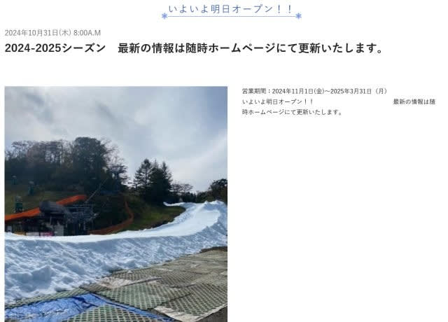

（[軽井沢プリンスホテルスキー場ホームページ](https://www.princehotels.co.jp/ski/karuizawa/winter/)より)

ただ…

その一方，イエティは本日11月1日も営業中止(涙)

これでオープン後3日だけ営業，それも初日以外は

ナイター無しで，その後10/28から11/1まで

5日間営業できず…

イエティの造雪量をもってしてここまでとは，

ここしばらく経験のないレベルの高温＆雨

だったんだな…

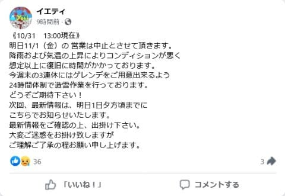

（[イエティFacebook](https://www.facebook.com/YetiSnowtown/posts/pfbid02im5Nk2ojK4dkvjDtZ5uuRpJWAx5RQQj1xh7WJABV6WzG9sqzEwvB9zqzfDAPTa1Hl)より）

イエティのライブカメラを見ると…

昨日からほとんど変わってない状態で．

明日オープンできたとしても，かなり

コースが狭くなりそうな感じ…

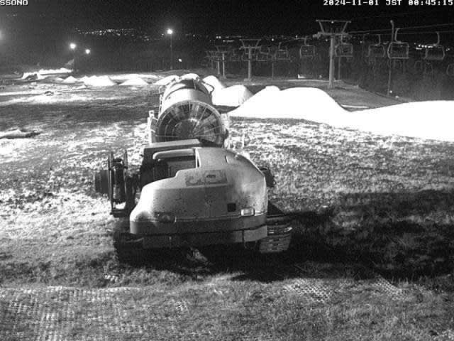

（[WNIライブカメラ](http://webcam.wni.co.jp/KAC24326/loop.html)より）

で．

仮に明日2日に再オープンしても．

水曜から予告しているように，

1日夜から3日朝までは，台風崩れの

低気圧で豪雨になります…

最新の天気図を見ても，2日は終日

すっぽり本州が降水域に覆われていて．

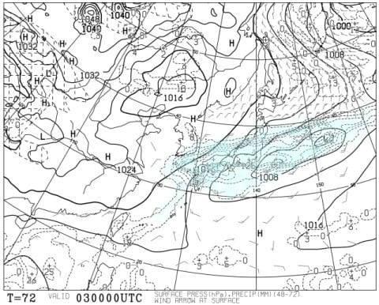

…さらに拡大すると…

ちょうど静岡の当たりに，125って数字が

見えますが…

これ，24時間降水量が125mmですね（激泣）

静岡近辺，125mmを越える，年に数回もない

レベルの豪雨になりそうなので…

おそらく，イエティの雪はまた壊滅しそうな

予感…（泣）

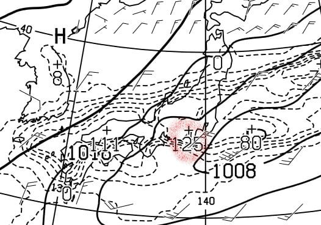

果たして．

イエティは明日2日に再オープンして，

3日まで雪がもつのか？？

…おそらく今のライブカメラで見た

雪の量だと，雪山を崩して広げてコースを

作っちゃうと，2日の豪雨と高温を乗り

越えるのは厳しいと思う…

そもそも，2日の豪雨で営業するのは

厳しいんじゃないかな？？

だとすると，3連休初日の2日の営業を

あきらめて，雪山を崩さずに雪を温存して

3日以降にかける手もあるけど…

…果たしてどうなるんだろう…？？？

とりあえず．

今晩9時ごろから雨が降り始め，

午後にはすごい豪雨になると思いますが．

うーん．

軽井沢は，雪の厚みがあるから，3日まで雪は

もつだろうなぁ…

ってなことで．

この3連休なら，雨が上がった3，4日に軽井沢に

行くのが良さそうな感じを受けますが．

たぶん，軽井沢は死ぬほど混むだろうなぁ…

あ，一応狭山も11月1日オープンです！

ここは屋根があるから，雨の影響は少ないかな…

ということで．

この3連休もちょっと残念な天気ではありますが．

そのあと，予告通り5日から7日か8日までは

ちょっと冷えますよ～！！！

…で．

皆さんご存じ，木曜は気象庁の1か月予報の

発表日なので．

11月の1か月の天気予想が出たわけですが…

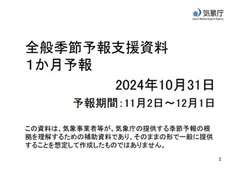

エルニーニョの今年は，これまでの高温が

打って変わって，冷える11月になるはずだ！！

と，強く信じて資料を読み進めたところ…

…

…

…

…

…

なんだこりゃ（激泣）

これは…

結局11月も最終週まで高温傾向が続く

じゃないか！！！（激涙）

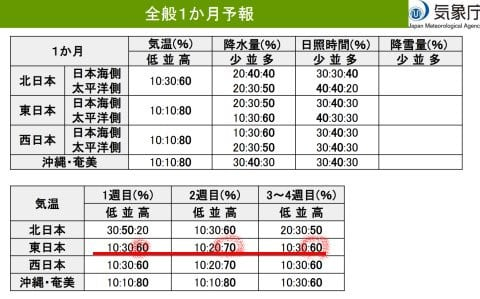

がーん．

11月下旬は冷えると期待していたのに…

ショック…

まず，11月第1週，11/2-11/8の850hPa気温を

見ると．

これは5日以降ちょっと冷えそう，というのが

反映されて，日本は気温が平年より低い網掛け

領域におおむね覆われてます！！！

ただ，850hPa(高度およそ1500m)は平年比

マイナスでも，地上気温は高温の見込み

という，気象庁の人の職人的読み込みが入って，

高温傾向とみているようです…

まぁ，山は冷えてくれるかな．

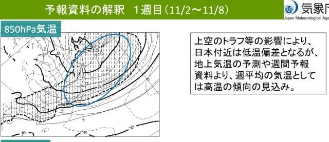

そして，11月第2週，11/9-11/15の850hPa気温

を見ると．

赤く描いた平年比+3℃線が本州を横切ってます…

来週ちょっと冷えたと思ったら，そのあとは

また1週間の平均気温が平年比+3℃という，

異常高温に戻るようです(泣)

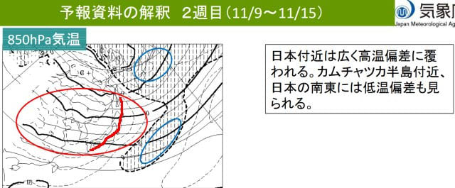

そして．11月3-4週，11/16-11/29の850hPa

気温を見ると．

うげげげげ～っ！！！

赤く塗りつぶした平年比+3℃エリアに，

本州がほぼすっぽり覆われてます…

2週間平均が＋３℃って…

あり得ない…

11月下旬も異常気象レベルの高温にまた戻るんですが！？？

11月は冷えるんじゃなかったの！？？（心の叫び）

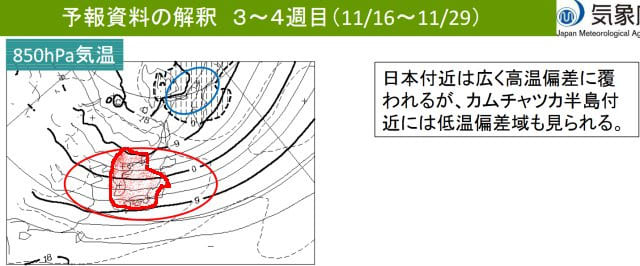

850hPaの気温推移のグラフを見ても．

水色矢印で示した11/5～11/8くらいの期間は

一瞬冷えるものの．

その後はまた，赤矢印で示したように

平年比+3℃以上に戻り．

12月ごろまで，異常高温が続きそうな

予想です…（止まらぬ涙）

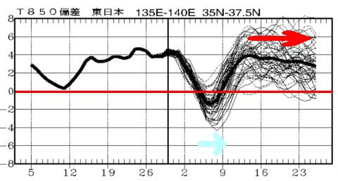

…ということで．

ラニーニャはどうした！？？

という感じの高温が続く11月になりそうで．

また11月下旬に営業開始予定のスキー場の

オープンが軒並み遅れそうな，いやな

気配を感じますが…

いつも言ってますが．

1か月予報の第3，4週は外れることが

多いのだ！！

今から2週間たったら，実は激冷えの

11月下旬になっていた…

ということもありうるのだ！！

…それを信じて，今は寒気の歌を歌いつづけ，

そして祈り続け…さらに休まず止まらず，

全身全霊の冷え冷え踊りを踊り続ける

のだ！！←あまりもの想定外の予報にテンションがおかしくなっている
