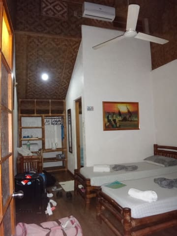
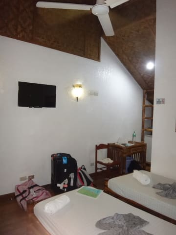
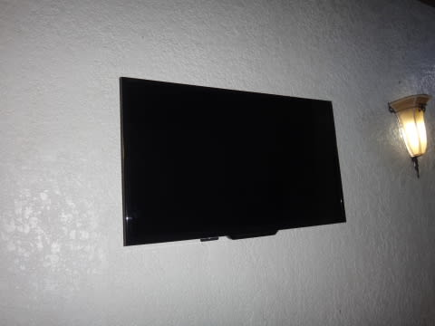
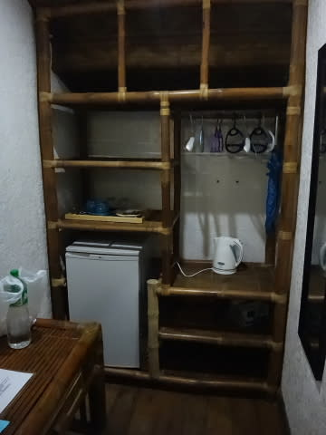
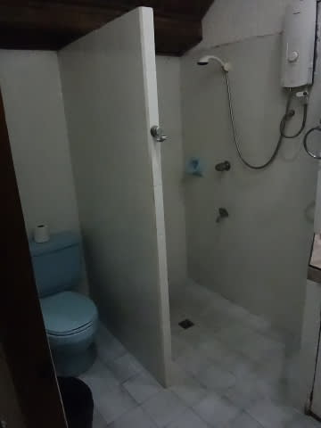
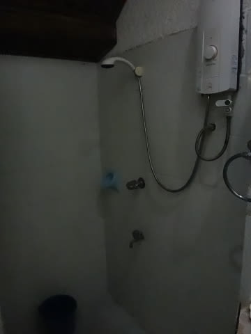
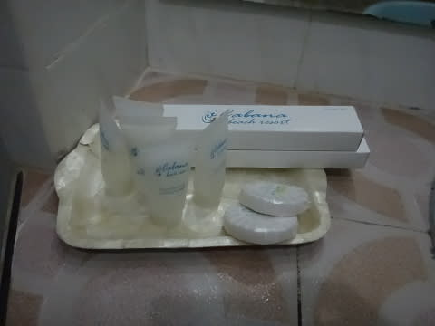
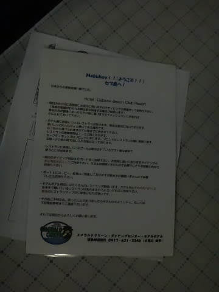

# 2015年8月　子連れでモアルボアルでダイビングその2…泊まった宿はこんなところ

📅 投稿日時: 2015-10-20 02:38:04

ということで．

初滑りが終わったというのに．

ようやっと，スキーヤーブログらしくなったというのに．

…また，夏の話題に戻るのだ…

ってことで，モアルボアル旅行記へ，Go！

---

で．

セブ空港から3時間半の自動車移動を終えて．

深夜11時に，4泊を過ごすホテル，

「カバナビーチリゾート」

に到着したわけですが．

部屋の中はこんな感じで…

部屋の広さは，

まーまー，普通かな．

シングルベッドが二つ並んだ，ツインの部屋で，

ちゃんとエアコンもあるし，

TVも，液晶壁掛けテレビだし．

ポットも冷蔵庫もあるし．

…セキュリティーボックスがないのが，惜しいけど．

まぁ，一通りのモノが揃っているかな．

ただ，水周りは…

うーむ．

バスタブなし，シャワーのみ．

シャワーも，こんな電気式瞬間湯沸かし器タイプで，

湯量はあんまり期待できないやつです．

で，水回り全般，ちょっと古さを感じさせるかな…

でも．

とりあえず，アメニティも揃ってるし．

まぁ，一泊朝食付きのルームチャージが

8000円くらいの宿だから，

＃一人分じゃないよ，一部屋分だよ！

まぁ，こんなところかな．

我が家が泊まるレベルとしては，標準的なところですな．

で．

ダイブショップが作ったらしい，

こんな日本語の説明書きがホテルに置いてありました…

ホテルの細かな説明や，周囲のレストランの

マップなどもあって，結構便利．

で，このホテル．

ちゃんと無料Wifiが使えます．

日本のWebページにも，十分な速度でつながって，

ちゃんと使えるWifiでした．

ってことで．

もう，夜が遅いので．

シャワーを浴びたら，

明日のダイビングに備えて，おやすみなさい…
